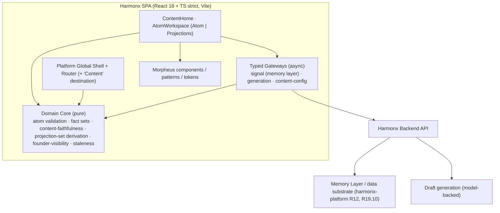
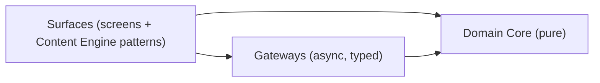
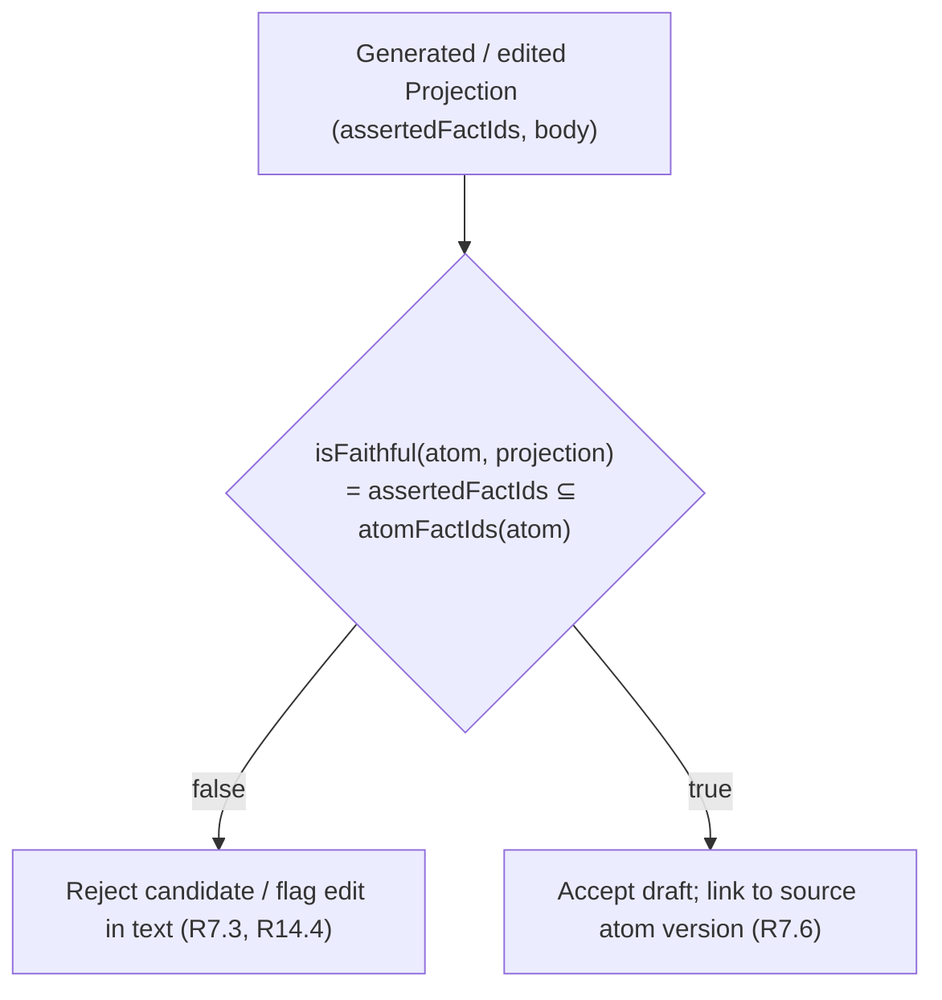

# Design Document — Harmonx Content Engine

## Overview

The Harmonx Content Engine is a new authenticated section inside the Harmonx platform. A founder authors one **Insight Atom** — the committed source of truth (one behavioral insight, one proof signal pulled from the Harmonx memory layer, one brand example, one content pillar) — and the engine generates platform-native **Projections** (Substack essay, X thesis, Instagram carousel, and a founder video brief that serves both TikTok and Instagram Reels).

The design follows the same discipline as the `harmonx-platform` and `harmonx-landing` specs: the parts the requirements make verifiable live in a **Domain Core** of pure, dependency-free TypeScript, and React surfaces render Morpheus components and delegate every decision to the Domain Core and typed Gateways. This keeps the testable rules out of React and out of the network layer.

The single governing rule mirrors the platform's anti-hallucination architecture. The platform guarantees **data-faithfulness** (a styled render may change aesthetics but never the plotted values). The Content Engine guarantees the direct analog — **content-faithfulness**: a Projection may change format, length, ordering, and platform voice, but the set of meaning-bearing content facts it asserts (claims, statistics, brand facts) is always a subset of the facts in its source atom. This is modeled as a single pure predicate, `isFaithful`, that every generation and edit path consults, so it is unit- and property-testable in isolation rather than re-implemented per surface.

The Content Engine composes Morpheus components and alias tokens only, is dark-first (`data-theme`), declares all states, ships reduced-motion / reduced-transparency / forced-colors fallbacks, passes the WCAG 2.2 AA gate, and follows the Morpheus voice. Per tech.md, no browser storage APIs are used in any render path; atom and projection state is held in memory only.

### Key design decisions

- **Reuse, don't reinvent.** The Content Engine lives in the platform shell (extending `harmonx-platform` R1's left navigation with a "Content" destination) and reaches the **data substrate / memory layer** through a typed gateway to attach a Proof Signal (R4, referencing platform R12 / R19.10). It reuses the platform's `Backlink`, `Confidence`, and capability-resolution primitives from the shared `src/domain` module rather than copying them.
- **Content facts are the testable unit.** Faithfulness is enforced over a **structured fact set** derived from the atom, not over free text. An atom yields a canonical set of `ContentFact`s (one claim, one stat, one brand). A Projection carries the ids of the atom facts it asserts. Faithfulness is set-containment: `assertedFacts ⊆ atomFacts`. This resolves requirements OQ-2 by choosing the structured-extraction approach for the automated guarantee; free-text heuristics (political framing, over-disclosure) remain advisory (see Error Handling).
- **Generation and inference are server-side.** Draft generation from an atom runs behind a Gateway (model-backed, server-side). The client holds the resulting structured Projection in memory and enforces `isFaithful` on what it receives and on every subsequent human edit.
- **One video, two channels.** The Founder Video is a single `VideoBrief` projection whose `channels` field lists both TikTok and Instagram Reels; there is no duplicate artifact to keep in sync.

### Morpheus inventory this design builds on

Existing components (composed, not rebuilt): AppBar, Badge, Button, ButtonGroup, Card, Dialog, Divider, EmptyState, Field, IconButton, InlineMessage, Link, Menu, Select, Sheet, Skeleton, Switch, Tabs, Tag, Textarea, TextInput, Toast, Tooltip; primitive VisuallyHidden. Existing AI patterns: CitationCard (proof-signal backlink), GenerationState, StreamingText, ConfidenceIndicator, InlineMessage.

## Architecture



### Layered structure



- **Surfaces** (`src/screens/content/*`, `src/patterns/harmonx/content/*`): React components. Presentation only; decisions delegate to the Domain Core.
- **Domain Core** (`src/domain/content/*`, reusing `src/domain/*` shared primitives): pure functions and reducers. No React, no fetch, no storage. Where a primitive (`Backlink`, `Confidence`, capability resolution) is shared with the platform, it is imported, not copied.
- **Gateways** (`src/gateways/content/*`): typed async access — Proof Signal retrieval from the memory layer, draft generation, and content/config loading. Mockable; surfaces depend on interfaces.

### Content-faithfulness choke point



`isFaithful` is defined once in the Domain Core. Every draft that enters the client — from the generation gateway or from a human edit — passes through it. No surface re-implements the check.

### Cross-cutting resolution

- Dark-first; `data-theme="dark|light"` at the root. Alias tokens only (no raw hex/px/ms).
- Reduced motion → translate/scale motion becomes opacity crossfade or instant; no function gated on motion. Reduced transparency / forced-colors / low capability → material Tier 2 Solid. (Reuses the platform's `resolveMotion` / `resolveMaterialTier`.)
- Responsive xs–2xl; reflow to 320px and 200% zoom without loss or horizontal text scroll.
- Generation progress is announced through an `aria-live="polite"` managed region at chunk/sentence boundaries, never per token (R16.5).

## Components and Interfaces

Surfaces are thin React components; reusable interactive pieces are Content Engine **patterns** under `src/patterns/harmonx/content/`. All compose Morpheus primitives and Radix behavior and follow the five-file pattern (`X.tsx`, `X.module.css`, `X.stories.tsx`, `X.test.tsx`, `index.ts`), reference alias tokens only, declare all states, and ship axe + keyboard stories.

| Name | Kind | Location | Responsibility | Requirements |
|---|---|---|---|---|
| ContentHome | screen | `src/screens/content/ContentHome` | Atom list (insight summary + pillar); new-atom action; empty state | R1.2, R1.5 |
| AtomWorkspace | pattern | `src/patterns/harmonx/content/AtomWorkspace` | Two-area layout: Atom (source) and Projections; mode toggle | R1.3, R1.4, R13 |
| InsightAtomEditor | pattern | `src/patterns/harmonx/content/InsightAtomEditor` | Author insight + proof signal + brand example + pillar; validation; guardrail flags | R2, R3, R6 |
| ProofSignalPicker | component | `src/patterns/harmonx/content/ProofSignalPicker` | Pull one signal from the memory layer; value+label+backlink (CitationCard); empty state | R4 |
| BrandExamplePicker | component | `src/patterns/harmonx/content/BrandExamplePicker` | Select one brand from curated config set; name + note | R5 |
| PillarSelect | component | `src/components/PillarSelect` | Choose exactly one of three pillars (config-driven), text + description | R3 |
| ProjectionPanel | pattern | `src/patterns/harmonx/content/ProjectionPanel` | List the Projection Set; generate/regenerate; staleness banner; generation status | R7, R14, R16.5 |
| ProjectionEditor | pattern | `src/patterns/harmonx/content/ProjectionEditor` | Per-projection editable body; version history; faithfulness flag; founder-visibility | R8–R12, R14 |
| CarouselEditor | component | `src/patterns/harmonx/content/CarouselEditor` | Ordered slides with keyboard, non-drag reorder | R10 |
| FounderVisibilityToggle | component | `src/components/FounderVisibilityToggle` | Per-projection on-camera vs authored-voice; text state | R12 |
| GuardrailFlag | component | `src/components/GuardrailFlag` | Inline text flag for political framing / over-disclosure / unfaithful content | R6.2, R6.4, R7.3, R14.4 |

### Surface behavior notes

- **ContentHome (R1):** the "Content" nav entry is filtered by the shared capability resolver (R1.7). The atom list is `Card`s showing the behavioral-insight summary + pillar `Tag`; empty state uses the Morpheus voice (`EmptyState`).
- **AtomWorkspace (R1.3, R13):** `Tabs`/split layout with **Atom** and **Projections** areas. A `Switch`/`ButtonGroup` selects Simple Mode vs full mode; switching calls `deriveProjectionFormats(mode)` and reconciles the Projection Set (R13.4).
- **InsightAtomEditor (R2, R3, R6):** `Field`/`Textarea` for the behavioral insight, `ProofSignalPicker`, `BrandExamplePicker`, `PillarSelect`. `validateAtom` gates save and lists missing components in `InlineMessage` (R2.3, R3.3). Guardrail advisory flags (political framing, over-disclosure) render as `GuardrailFlag` and do not block save (they prompt revision, R6.2/R6.4).
- **ProofSignalPicker (R4):** queries the signal gateway (memory layer). A selected signal renders as a `CitationCard` (value + label + real evidence backlink). If the gateway returns nothing, a defined empty state names the gap and generation stays disabled (R4.3). Free-typed statistics without a backlink are not acceptable as a Proof Signal (R4.5).
- **ProjectionPanel (R7):** the generate action is disabled while `validateAtom` reports any missing component (R7.5). Generation runs through the generation gateway; `GenerationState` + an `aria-live="polite"` region announce progress. Returned drafts are checked with `isFaithful` before display; an unfaithful candidate is rejected with text (R7.3). Editing the atom marks existing projections stale via `isStale` (R7.4) with a banner offering regenerate/reconcile.
- **ProjectionEditor (R8–R12, R14):** renders the format-specific body (essay / thesis / carousel slides / video brief) as editable text. Regenerate acts on one projection only, retaining the prior draft in `versions` (R14.2, R14.3). A human edit that breaks faithfulness raises a `GuardrailFlag` while preserving the entered text (R14.4). `FounderVisibilityToggle` sets visibility per projection (R12).

### Gateways

```ts
interface SignalGateway {              // R4 — references harmonx-platform R12 / R19.10
  findSignals(atomContext: AtomContext): Promise<ProofSignal[]>;
}
interface GenerationGateway {          // R7 — server-side, model-backed
  generateSet(atom: InsightAtom, mode: AuthoringMode): Promise<Projection[]>;
  regenerate(atom: InsightAtom, format: ProjectionFormat): Promise<Projection>;
}
interface ContentConfigGateway {       // R3.1, R5.1, R9.3
  pillars(): Promise<ContentPillar[]>;         // exactly three
  brandExamples(): Promise<BrandExampleOption[]>;
  platformLimits(): Promise<Record<ProjectionFormat, PlatformLimit>>; // e.g. X character limit
}
```

Gateways return structured `Projection`s (with `assertedFactIds`), so the client can enforce faithfulness independently of how a draft was produced.

## Data Models

All models are TypeScript (strict) interfaces in `src/domain/content/types`, reusing shared primitives from `src/domain/types`. They are serializable and are the input/output shape for the pure Domain Core functions the Correctness Properties exercise. IDs are opaque branded strings to prevent cross-entity mixups.

```ts
// ---- Shared, reused from harmonx-platform Domain Core ----
interface Backlink { targetId: string; label: string; href: string; } // real link, discernible name
interface Confidence { value: number; label: string; }                 // text-surfaced, never color-alone

// ---- Content facts: the unit faithfulness is checked over ----
type FactKind = 'claim' | 'stat' | 'brand';
interface ContentFact {
  id: FactId;
  kind: FactKind;
  text: string;               // canonical wording of the claim / stat / brand fact
  backlink?: Backlink;        // stats carry an evidence backlink to the memory layer
}

// ---- Insight Atom: the committed source of truth ----
type AuthoringMode = 'simple' | 'full';

interface InsightAtom {
  id: AtomId;
  version: number;                 // increments on edit; projections pin the version they came from
  behavioralInsight: ContentFact;  // kind === 'claim'; the atom's Core-Insight analog
  proofSignal: ProofSignal | null; // kind === 'stat'; from the memory layer (R4)
  brandExample: BrandExample | null;
  pillarId: PillarId | null;       // exactly one (R3.2)
  mode: AuthoringMode;
}

interface ProofSignal {
  fact: ContentFact;               // kind === 'stat'; fact.backlink is required (R4.2, R4.5)
  value: number;
  label: string;
}
interface BrandExample {
  fact: ContentFact;               // kind === 'brand'
  brandName: string;
  note: string;                    // one-line: what the brand did
}

interface ContentPillar { id: PillarId; key: 'P1' | 'P2' | 'P3'; name: string; description: string; }
interface BrandExampleOption { id: string; brandName: string; note: string; culturalFooting: string; }
interface PlatformLimit { maxChars?: number; }

// ---- Projections: platform-native renderings of the atom ----
type ProjectionFormat = 'substackEssay' | 'xThesis' | 'igCarousel' | 'founderVideo';
type Channel = 'substack' | 'x' | 'instagram' | 'instagramReels' | 'tiktok';
type FounderVisibility = 'onCamera' | 'authoredVoice';

interface Projection {
  id: ProjectionId;
  format: ProjectionFormat;
  channels: Channel[];             // founderVideo -> ['tiktok','instagramReels']
  sourceAtomId: AtomId;
  sourceAtomVersion: number;       // the atom version this was generated from (R7.6, staleness)
  assertedFactIds: FactId[];       // the atom facts this projection asserts (faithfulness unit)
  body: ProjectionBody;            // format-specific editable content
  founderVisibility: FounderVisibility;
  versions: ProjectionVersion[];   // prior drafts retained on regenerate/edit (R14.3)
}
interface ProjectionVersion { at: IsoTimestamp; body: ProjectionBody; assertedFactIds: FactId[]; }

type ProjectionBody =
  | { format: 'substackEssay'; markdown: string }
  | { format: 'xThesis'; statement: string; liftedFromEssayId: ProjectionId }   // R9.1, R9.2
  | { format: 'igCarousel'; slides: Slide[] }
  | { format: 'founderVideo'; script: string; shotDirection: string; targetSeconds: number }; // 30..60
interface Slide { id: SlideId; order: number; text: string; visualNote?: string; }

// ---- Validation ----
interface MissingComponent { component: 'behavioralInsight' | 'proofSignal' | 'brandExample' | 'pillar'; }
interface ValidationResult { ok: boolean; missing: MissingComponent[]; }
```

### Pure Domain Core functions (the testable surface)

```ts
// Atom validation (R2.2, R2.3, R3.3, R5.4, R7.5)
function validateAtom(atom: InsightAtom): ValidationResult;
//  behavioralInsight non-whitespace, proofSignal present w/ backlink, brandExample present, pillar present

// Canonical fact set of an atom (R7.2)
function atomFactIds(atom: InsightAtom): ReadonlySet<FactId>;
//  = {behavioralInsight.id} ∪ ({proofSignal.fact.id} if present) ∪ ({brandExample.fact.id} if present)

// Content-faithfulness — the headline predicate (R7.2, R8.3, R9.2, R10.2, R11.3, R13.3)
function isFaithful(atom: InsightAtom, projection: Projection): boolean;
//  = projection.assertedFactIds ⊆ atomFactIds(atom)

// X thesis is lifted from the essay, not authored independently (R9.2, R13.2)
function isLiftedFrom(child: Projection, essay: Projection): boolean;
//  = child.assertedFactIds ⊆ essay.assertedFactIds  (and child.liftedFromEssayId === essay.id)

// Projection-set derivation by mode (R7.1, R13.1, R13.4)
function deriveProjectionFormats(mode: AuthoringMode): ProjectionFormat[];
//  full   -> ['substackEssay','xThesis','igCarousel','founderVideo']
//  simple -> ['substackEssay','xThesis','founderVideo']

// Channels for a format (R11.2)
function channelsFor(format: ProjectionFormat): Channel[];
//  founderVideo -> ['tiktok','instagramReels']

// Founder-visibility defaults, per projection (R12.2, R12.3)
function defaultFounderVisibility(format: ProjectionFormat): FounderVisibility;
//  founderVideo -> 'onCamera'; else -> 'authoredVoice'

// Staleness when the atom moves ahead of a projection (R7.4)
function isStale(projection: Projection, atom: InsightAtom): boolean;
//  = projection.sourceAtomVersion !== atom.version

// Regenerate/edit retains the prior draft as a version (R14.2, R14.3)
function withNextDraft(prev: Projection, next: ProjectionBody, assertedFactIds: FactId[]): Projection;
//  pushes prev {body, assertedFactIds} into versions; sets new body; other projections untouched by caller

// Carousel reorder (keyboard, non-drag) (R10.3)
function reorderSlides(slides: Slide[], from: number, to: number): Slide[]; // permutation, re-indexed order
```

`isFaithful` and `atomFactIds` are the crux: because a Projection carries the explicit atom-fact ids it asserts, faithfulness is exact set-containment, and any candidate (generated or hand-edited) that references a fact absent from the atom is rejected. The video brief's `targetSeconds` is constrained to the 30–60 range (R11.1), and the X thesis body carries `liftedFromEssayId` so `isLiftedFrom` is checkable.

## Correctness Properties

A property is a characteristic or behavior that should hold true across all valid executions of the system — a formal statement about what the software should do. Properties are the bridge between the acceptance criteria and machine-verifiable guarantees: each is universally quantified ("for all / for any") and is implementable as a single property-based test.

The prework consolidated the many faithfulness criteria (7.2, 7.3, 8.3, 10.2, 11.3, 13.3, 14.4) into one comprehensive property, and the many validation/atom-shape criteria (2.1–2.3, 3.2, 3.3, 4.1, 4.3, 5.1, 5.4, 7.5) into one validation property. Criteria that are subjective (editorial tone 6.1/6.3/6.5/6.4/6.2, founder-as-CEO framing 12.5), enforced by lint/review (token-only, no-storage, sentence-case: 1.5, 2.5, 14.5, 15.5, 16.1, 16.2), or verified by the manual a11y protocol (reflow/zoom/targets 15.1–15.4, WCAG gate 16.3, color-alone 16.4) are covered by unit tests, static checks, or the manual protocol rather than the properties below. Material/motion resolution (16.6, 16.7) reuse the platform's `resolveMaterialTier`/`resolveMotion` properties and are not restated here.

**Property 1: Atom validation reports exactly the missing components**
*For any* `InsightAtom`, `validateAtom(atom)` returns `ok === true` with no missing components when the behavioral insight is non-whitespace text, a proof signal with an evidence backlink is present, a brand example is present, and exactly one pillar is assigned; otherwise it returns `ok === false` with one `MissingComponent` entry for each absent-or-invalid component and none for the present ones. Generation and save read this result, so neither proceeds while any component is missing.
**Validates: Requirements 2.1, 2.2, 2.3, 3.2, 3.3, 4.3, 5.4, 7.5**

**Property 2: A proof signal is valid only with value, label, and evidence backlink**
*For any* candidate `ProofSignal`, it is acceptable as an atom's proof signal if and only if it carries a numeric value, a non-empty label, and an evidence backlink to the Harmonx memory layer; a free-typed statistic lacking a backlink is never acceptable.
**Validates: Requirements 4.2, 4.5**

**Property 3: Content-faithfulness holds for every projection (in both directions)**
*For any* `InsightAtom` and *any* `Projection` bound to it, `isFaithful(atom, projection)` returns true if and only if `projection.assertedFactIds` is a subset of `atomFactIds(atom)`; when it returns false the projection is rejected (on generation) or flagged in text (on human edit) and never silently accepted. No projection — essay, thesis, carousel slide, or video brief, in simple or full mode — asserts a claim, statistic, or brand fact absent from its source atom.
**Validates: Requirements 7.2, 7.3, 8.3, 10.2, 11.3, 13.3, 14.4**

**Property 4: The Substack essay carries the complete atom argument**
*For any* generated Substack essay projection, its asserted fact set equals the atom's full fact set (behavioral insight, proof signal, and brand example) — the essay presents the complete argument, not a subset.
**Validates: Requirements 8.1**

**Property 5: The X thesis is lifted from the essay and within the platform limit**
*For any* X thesis projection and the essay it derives from, `isLiftedFrom(thesis, essay)` holds — the thesis's asserted fact set is a subset of the essay's and it references that essay's id — so the thesis is lifted from the essay rather than authored independently; and the thesis statement length does not exceed the configured platform character limit.
**Validates: Requirements 8.2, 9.1, 9.2, 9.3, 13.2**

**Property 6: Projection-set formats and channels are a pure function of mode**
*For any* authoring mode, `deriveProjectionFormats(mode)` returns exactly the full set `[substackEssay, xThesis, igCarousel, founderVideo]` for `full` and exactly `[substackEssay, xThesis, founderVideo]` for `simple`; and for any format `channelsFor(format)` maps `founderVideo` to both `tiktok` and `instagramReels` (one artifact, two channels). Switching an atom's mode yields the set corresponding to the new mode.
**Validates: Requirements 7.1, 11.2, 13.1, 13.4**

**Property 7: The founder video brief targets 30–60 seconds with real direction**
*For any* generated `founderVideo` projection, `targetSeconds` lies within the inclusive range 30 to 60 and the script and shot direction are non-empty.
**Validates: Requirements 11.1**

**Property 8: Founder-visibility defaults follow the format**
*For any* projection format, `defaultFounderVisibility(format)` returns `onCamera` for the talking-head format (`founderVideo`) and `authoredVoice` for authored formats (`substackEssay`, `xThesis`, `igCarousel`); the function is total and deterministic.
**Validates: Requirements 12.2, 12.3**

**Property 9: Changing one projection's founder visibility leaves the others unchanged**
*For any* Projection Set and any single projection whose founder visibility is changed, exactly that projection's visibility changes and every other projection's visibility is unchanged.
**Validates: Requirements 12.4**

**Property 10: A projection pins its generating atom version and goes stale only when the atom advances**
*For any* projection generated from an atom, the projection records the atom's version at generation time, and `isStale(projection, atom)` is true if and only if the atom's current version differs from the recorded version.
**Validates: Requirements 7.4, 7.6**

**Property 11: Regeneration is isolated and retains the prior draft**
*For any* Projection Set, regenerating one projection via `withNextDraft` leaves every other projection unchanged, and the regenerated projection retains its immediately prior body and asserted fact set as a recoverable entry in its version history.
**Validates: Requirements 14.2, 14.3**

**Property 12: Carousel reordering is an order-preserving permutation**
*For any* list of slides and any valid from/to indices, `reorderSlides` returns a permutation of the input slides (no slide added or lost) with `order` values re-indexed to reflect the new sequence.
**Validates: Requirements 10.1, 10.3**

**Property 13: The atom list renders each atom's insight summary and pillar**
*For any* set of atoms, the rendered atom list contains, for each atom, its non-empty behavioral-insight summary text and its assigned pillar as text, so an atom is identifiable without relying on color or position alone.
**Validates: Requirements 1.2, 2.6, 3.4**

**Property 14: Generation progress announces each meaningful change exactly once**
*For any* sequence of generation status events, the managed `aria-live="polite"` region emits one announcement per meaningful state change (deduped by change key) and never announces intermediate duplicate frames, so screen readers are not spammed.
**Validates: Requirements 16.5**

## Error Handling

- **Missing atom component (R2.3, R3.3, R4.3, R5.4, R7.5):** `validateAtom` gates both save and generation; the editor lists each missing component in an `InlineMessage`, and the generate action stays disabled until the atom is complete (Property 1).
- **No available proof signal (R4.3):** when the signal gateway returns no signal, `ProofSignalPicker` shows a defined empty state naming the gap in text; generation remains blocked (the atom is incomplete).
- **Unfaithful generated candidate (R7.2, R7.3):** any draft returned by the generation gateway is checked with `isFaithful` before display; a candidate asserting a foreign fact is rejected and the reason is stated in text — it is never rendered as a draft (Property 3).
- **Unfaithful human edit (R14.4):** an edit whose fact set leaves the atom's set raises a `GuardrailFlag` in text while preserving the user's entered text for revision; the edit is not silently discarded.
- **Editorial guardrail advisories (R6.2, R6.4):** political-framing and over-disclosure flags are advisory (heuristic/model-assisted, non-deterministic) and prompt revision without blocking save; they surface as `GuardrailFlag` text, never color alone.
- **Stale projections after atom edit (R7.4):** editing the atom advances its version; `isStale` marks existing projections, and `ProjectionPanel` shows a banner offering regenerate or reconcile (Property 10). Stale drafts are retained, not deleted.
- **Generation gateway failure (R7):** a rejected generation surfaces a plain-language error via `GenerationState` and preserves any existing drafts; the user can retry. Partial sets are not persisted as complete.
- **Regeneration (R14.2, R14.3):** regenerate affects one projection only; the prior draft is pushed into version history before the new body is set, so no edit is lost (Property 11).
- **Reduced motion / transparency / forced-colors (R16.6, R16.7):** resolved centrally via the reused platform resolvers; animated surfaces degrade to crossfade/instant and material drops to Tier 2 Solid; no function is gated on a motion effect.
- **No browser storage (R2.5, R14.5, tech.md):** all atom, projection, and version state lives in memory; a reload intentionally resets state rather than persisting it.

## Testing Strategy

**Dual approach.** Unit tests cover concrete examples, copy, and edge/error cases; property-based tests cover the universal rules in the Domain Core. Both are required and complementary. Property tests handle broad input coverage, so unit tests stay focused on specific examples, integration points, and edge/error conditions.

**Property-based testing.**
- Library: **fast-check** with Vitest (the platform's stack). Property-based testing is not implemented from scratch.
- Each of the 14 correctness properties is implemented by exactly one property-based test, configured to run **at least 100 iterations**.
- Each property test is tagged with a comment: **Feature: harmonx-content-engine, Property {number}: {property text}**.
- Generators: `InsightAtom` arbitraries with any subset of missing/invalid components (Properties 1, 3, 4, 10); `ProofSignal` arbitraries including backlink-less candidates (Property 2); `Projection` arbitraries whose `assertedFactIds` are drawn both from and outside `atomFactIds` to exercise both directions of faithfulness (Property 3); essay/thesis pairs with subset and superset fact sets plus over-limit statements (Properties 4, 5); enumerated `AuthoringMode`/`ProjectionFormat` arbitraries (Properties 6, 8); Projection-Set arbitraries for visibility independence and regeneration isolation (Properties 9, 11); slide-list arbitraries with arbitrary from/to indices (Property 12); atom-set arbitraries for list rendering (Property 13); arbitrary generation-status event sequences for the live-region reducer (Property 14). The `ContentFact`/`Backlink` generators reuse the shared `src/domain` arbitraries where available so the faithfulness guarantee stays consistent with the platform's data-faithfulness tests.

**Unit / interaction tests (Vitest + Testing Library).**
- Structure and copy: the "Content" nav entry presence and capability gating (R1.1, R1.7), the two-area atom workspace (R1.3), new-atom empty surface (R1.4), exactly-three pillars from config (R3.1), proof-signal and brand-example rendered as text with a real backlink/label (R4.4, R5.2, R5.3), editable bodies preserving the source-atom link (R8.4, R9.4, R11.4), and mode-switch reconciliation (R13.4).
- Behavior on top of the properties: generation disabled on an incomplete atom, an unfaithful candidate rejected with a visible reason, a stale banner appearing after an atom edit, and a regenerate retaining the prior draft — concrete examples layered over Properties 1, 3, 10, 11.

**Accessibility testing (the gate).**
- Automated **jest-axe / @axe-core** on every component.
- Manual protocol per `morpheus-accessibility.md`: keyboard-only (including the non-drag carousel reorder), VoiceOver + NVDA (including the generation live region), 200% zoom and 320px reflow, reduced-motion, reduced-transparency, and forced-colors. These cover the criteria marked non-testable in the prework (1.5, 6.x, 12.5, 15.1–15.4, 16.1–16.4).

**Static / lint.**
- Token-only enforcement (no raw hex/px/ms), no browser-storage APIs in render paths, and voice/sentence-case checks are enforced by lint and review rather than runtime tests (prework: 1.5, 2.5, 6.5, 14.5, 15.5, 16.1, 16.2).
