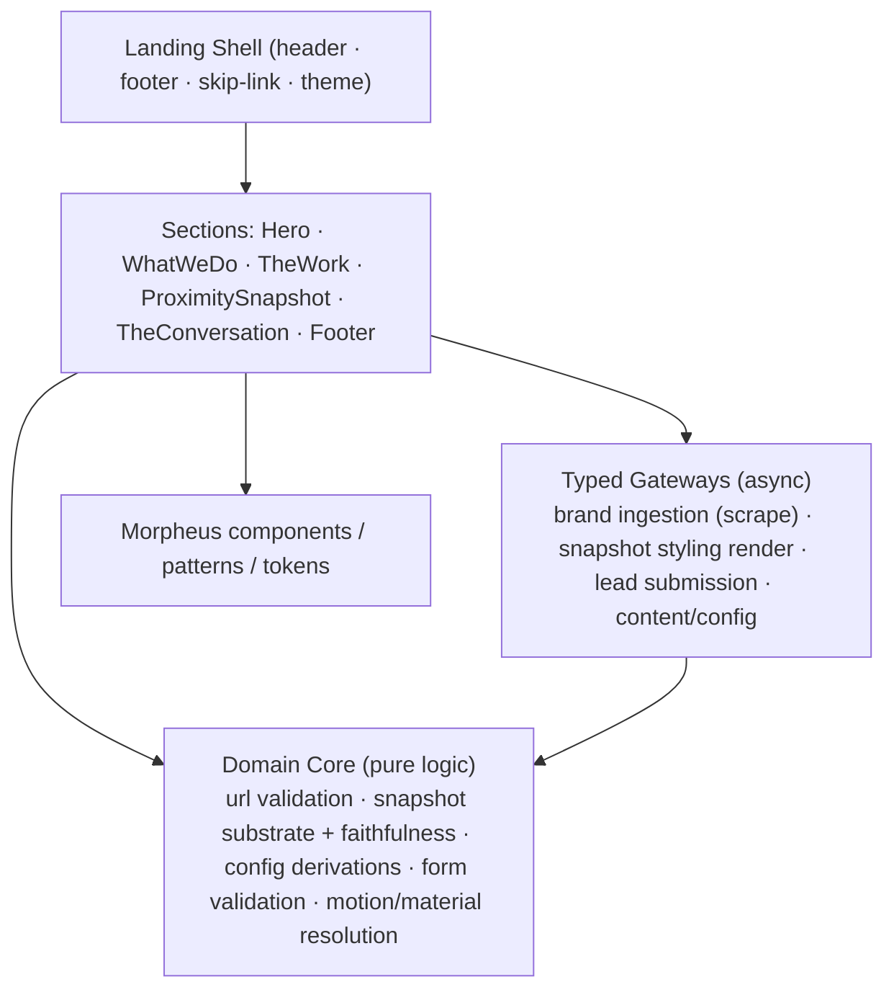
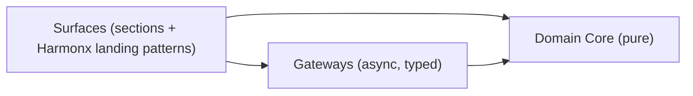

# Design Document — Harmonx Landing (Brand Imprint™ Platform)

## Overview

The Harmonx landing page is a single, mostly-static marketing surface with one genuinely interactive centerpiece — the **Proximity Snapshot**. Its job is narrow and high-stakes: within ten seconds a CMO should feel that Harmonx describes their customer better than they can, and want to talk.

The design follows the same discipline as the `harmonx-platform` spec: the parts the requirements make verifiable — URL validation, the Proximity Snapshot's deterministic data substrate and its faithfulness guarantee, config-driven display derivations, lead-form validation, and motion/material resolution — live in a **Domain Core** of pure, dependency-free TypeScript. React sections render Morpheus components and call into the Domain Core and typed Gateways. This keeps the testable rules out of React and out of the network layer, and lets the landing page **reuse** the platform's `DataSubstrate` and `preservesDataSubstrate` logic rather than reinventing it.

The page is six sections in a fixed order — Hero, What We Do, The Work, The Proximity Snapshot, The Conversation, Footer — wrapped in a sovereign, minimal shell. It is dark-first, composes Morpheus components and alias tokens only, declares all states, ships reduced-motion / reduced-transparency / forced-colors fallbacks, and passes the WCAG 2.2 AA gate. Client work shown in case studies renders in each client's own brand language, never in Morpheus tokens. No browser storage APIs are used in any render path.

### Key design decisions

- **Reuse, don't reinvent.** The Proximity Snapshot's quantitative layer is the platform's `DataSubstrate` model and `projectDataSubstrate`/`preservesDataSubstrate` functions (harmonx-platform R19.10, R19.14), specialized to a lightweight input (scraped signal + four answers). The same data-faithfulness guarantee carries.
- **Marketing site, not the app.** Per the resolved reconciliation decisions, there is no public pricing and no prominent sign-in. The primary conversion is a conversation (Lead Capture). This keeps the surface small and the blast radius low.
- **Motion is resolved once, centrally.** A single pure `resolveMotion` decides play-vs-fallback for every animated moment (hero film, card breathe, mirage reveal). Material tier resolves the same way. Function is never gated on animation.
- **Server-side scraping.** The lightweight brand ingestion (URL scrape) runs behind a Gateway, not in the browser; the client only holds the resulting signal in memory.

## Architecture



### Layered structure



- **Surfaces** (`src/screens/landing/*`, `src/patterns/harmonx/*`): React components. Presentation only; all decisions delegate to the Domain Core.
- **Domain Core** (`src/domain/landing/*`, reusing `src/domain/*` from the platform where shared): pure functions and reducers. No React, no fetch, no storage. Where the Proximity Snapshot substrate logic is shared with the platform, it is imported from the shared `src/domain` module rather than copied.
- **Gateways** (`src/gateways/*`): typed async access — brand ingestion (server-side scrape), the snapshot styling render, lead submission, and content/config loading. Mockable; surfaces depend on interfaces.

### Cross-cutting resolution

- Dark-first; `data-theme="dark|light"` at the root. Alias tokens only in every surface and pattern (no raw hex/px/ms).
- `resolveMotion` and `resolveMaterialTier` run once per session from media queries and capability, and every animated/material surface reads their result. Reduced motion → the hero film shows its poster frame, the card breathe becomes instant, and the mirage reveal becomes a plain fade. Reduced transparency / low capability / forced-colors → Material Tier 2 Solid.
- Responsive xs–2xl; reflow to 320px and 200% zoom without loss or horizontal text scroll.

## Components and Interfaces

Sections are thin React components; the reusable interactive pieces are Harmonx landing **patterns**. All compose Morpheus primitives and Radix behavior.

| Name | Kind | Location | Responsibility | Requirements |
|---|---|---|---|---|
| LandingShell | shell | `src/screens/landing/LandingShell` | Header (HX mark + minimal nav), footer (no newsletter), skip-link, theme root | R1 |
| HeroFilm | pattern | `src/patterns/harmonx/HeroFilm` | Full-screen looping film + poster fallback + pause; positioning text overlay | R2 |
| WhatWeDo | pattern | `src/patterns/harmonx/WhatWeDo` | Config-driven expandable stage disclosures (Radix Accordion) | R3 |
| TheWork | pattern | `src/patterns/harmonx/TheWork` | 2×2 case-study grid; breathe emphasis; opens Case Study Detail | R4 |
| CaseStudyDetail | pattern | `src/patterns/harmonx/CaseStudyDetail` | Sizzle + six-part structure, in client brand + Data Humanism framing | R4 |
| ProximitySnapshot | pattern | `src/patterns/harmonx/ProximitySnapshot` | Orchestrates intake → questions → output → mirage → contact | R5, R6, R7 |
| SnapshotIntake | component | `src/patterns/harmonx/ProximitySnapshot/SnapshotIntake` | URL field + four questions one at a time; live-region status | R5 |
| MicroDataHumanism | component | `src/patterns/harmonx/ProximitySnapshot/MicroDataHumanism` | Renders the substrate + styled layer; accessible value labels | R6 |
| MirageReveal | component | `src/patterns/harmonx/ProximitySnapshot/MirageReveal` | Particle dissolution → Contact Surface; fade fallback | R7 |
| TheConversation | pattern | `src/patterns/harmonx/TheConversation` | Full-screen closing CTA | R8 |
| LeadCaptureForm | pattern | `src/patterns/harmonx/LeadCaptureForm` | Validated email capture or calendar link; confirmation/error | R9 |
| AssetRenderFrame | component | `src/components/AssetRenderFrame` | Sandboxed render-preview surface for styled snapshot; no browser storage | R6, tech.md |

### Section behavior notes

- **Hero (R2):** `HeroFilm` reads `resolveMotion`. Playing → muted looping `<video>` with a pause control and the poster as `poster`. Fallback → the poster ``. The positioning line is real DOM text layered over the media (not baked in), with a contrast-safe scrim resolved by material tier.
- **What We Do (R3):** Radix Accordion; items come from `stageItems` config; `orderStageItems` guarantees display order; `aria-expanded` is native to the Radix trigger.
- **The Work (R4):** grid from `caseStudies` config; each card sets its own client brand color via a scoped CSS custom property (client brand, not Morpheus). Empty config → defined empty state.
- **Proximity Snapshot (R5–R7):** a reducer-driven state machine (`snapshotReducer`) with phases `intake → questions → processing → output → revealing → contact`, plus `error`. `SnapshotIntake` validates the URL with `isValidBrandUrl` before leaving `intake`; the four questions advance one at a time. `processing` awaits the ingestion Gateway; `MicroDataHumanism` projects the substrate (pure) then requests the styling render (Gateway). The Contact Surface is always reachable (including from `error`) and is never gated on the mirage animation.
- **The Conversation (R8)** and **Lead Capture (R9):** both route to `LeadCaptureForm`, which validates via `validateLeadForm` and renders confirmation/error states; all state in memory.

## Data Models

All models are TypeScript (strict) interfaces in `src/domain/landing/types` (shared substrate types imported from `src/domain/types`). They are serializable and are the input/output shape for the pure Domain Core functions the Correctness Properties exercise.

```ts
// ---- Content / config (loaded via Gateway; drives display) ----
interface StageItem { id: string; name: string; description: string; order: number; }
interface CaseStudy {
  id: string;
  brandLabel: string;            // e.g. "Life with Hennessy" (text, never color-only)
  clientBrandColor: string;      // client's own brand color (not a Morpheus token)
  logoAlt: string;               // required text alternative
  order: number;
  detail: CaseStudyDetail;
}
interface CaseStudyDetail {
  sizzle: MediaRef;
  person: string; world: string; insight: string; strategy: string; creativeDirection: string;
}
interface MediaRef { src: string; posterSrc: string; description: string; }
interface PageMeta { title: string; description: string; canonicalUrl: string; ogImage: string; lang: string; }

// ---- Proximity Snapshot ----
type GrowthChallenge = 'awareness' | 'conversion' | 'retention' | 'relevance' | string;
interface SnapshotAnswers {
  audience: string;                 // Q1 who are you trying to reach
  offerAndValue: string;            // Q2 what are you selling + why care
  growthChallenge: GrowthChallenge; // Q3
  understandingConfidence: number;  // Q4 sliding scale 0..1
}
interface BrandSignal {             // output of lightweight ingestion (scrape only)
  sourceUrl: string;
  palette: string[]; toneTerms: string[]; positioningTerms: string[]; channelTerms: string[];
}

// ---- Reused from harmonx-platform Domain Core (R19.10, R19.14) ----
interface DataSubstrate {           // deterministic quantitative layer
  sourceKey: string;                // stable hash of (signal + answers)
  encodings: Encoding[];
}
interface Encoding { datumId: string; label: string; value: number; channel: 'height'|'proportion'|'position'|'angle'; encoded: number; }

interface StyleConditioning { referenceAssetIds: string[]; }   // Du Bois / Lupi lineage
interface MicroSnapshotRender {
  substrate: DataSubstrate;         // values/encodings that must be preserved
  styling: StyleConditioning;
  styledAssetId: string;            // gated styling-layer output (render preview)
}

// ---- Lead capture ----
interface LeadForm { name: string; email: string; message?: string; }
interface FieldError { field: keyof LeadForm; message: string; }
interface ValidationResult { ok: boolean; errors: FieldError[]; }

// ---- Motion / material ----
type MotionPreference = 'full' | 'reduced';
type MotionDecision = 'play' | 'fallback';
type MaterialTier = 'true' | 'simulated' | 'solid';
interface DeviceCapability { backdropFilter: boolean; reducedTransparency: boolean; forcedColors: boolean; }

// ---- Snapshot state machine ----
type SnapshotPhase = 'intake' | 'questions' | 'processing' | 'output' | 'revealing' | 'contact' | 'error';
interface SnapshotState {
  phase: SnapshotPhase;
  url: string; urlValid: boolean;
  questionIndex: number;            // 0..3
  answers: Partial<SnapshotAnswers>;
  signal?: BrandSignal;
  render?: MicroSnapshotRender;
  error?: string;
}
```

### Pure Domain Core functions (the testable surface)

```ts
// URL validation (R5.2)
function isValidBrandUrl(input: string): boolean; // http(s) + valid host; no free error swallow

// Snapshot substrate — deterministic projection of signal + answers (R6.1, R6.4)
function projectSnapshotSubstrate(signal: BrandSignal, answers: SnapshotAnswers): DataSubstrate; // pure, no model

// Data-faithfulness (R6.3) — reused from platform (R19.14)
function preservesDataSubstrate(before: DataSubstrate, render: MicroSnapshotRender): boolean;
//  = every encoding in render.substrate matches `before` by datumId, value, channel, encoded;
//    styling may add aesthetic attributes but may not add/drop/change a meaning-bearing encoding.

// Config-driven display derivations (R3.2, R4.1)
function orderStageItems(items: StageItem[]): StageItem[];      // stable ascending by order
function orderCaseStudies(items: CaseStudy[]): CaseStudy[];     // stable ascending by order

// Lead-form validation (R9.3)
function validateLeadForm(form: LeadForm): ValidationResult;    // name non-whitespace; email well-formed

// Motion / material resolution (R12.1–R12.3)
function resolveMotion(pref: MotionPreference): MotionDecision;         // 'reduced' -> 'fallback'
function resolveMaterialTier(cap: DeviceCapability): MaterialTier;      // reducedTransparency|!backdropFilter|forcedColors -> 'solid'

// Snapshot reducer (R5.4, R7.4) — pure transition
function snapshotReducer(state: SnapshotState, event: SnapshotEvent): SnapshotState;
```

## Correctness Properties

A property is a characteristic or behavior that should hold true across all valid executions of the system — a formal statement about what the software should do. Properties are the bridge between the acceptance criteria and machine-verifiable guarantees: each is universally quantified ("for all / for any") and is implementable as a single property-based test.

The prework consolidated criteria that restate the same rule (substrate determinism, config ordering, the snapshot state machine, motion/material resolution, form validation). Criteria marked example/edge-case/non-testable are covered by unit tests or the manual a11y protocol (see Testing Strategy), not by the properties below. Each property below validates a distinct rule; most of the landing page's testable logic lives in the pure Domain Core, and the Proximity Snapshot substrate/faithfulness properties are the landing-page specialization of the platform's Data Humanism guarantees.

**Property 1: Brand URL validation is correct**
*For any* input string, `isValidBrandUrl(input)` returns true if and only if the string is a syntactically well-formed absolute http(s) URL with a valid host; it never throws and never returns true for a blank, scheme-less, or malformed string.
**Validates: Requirements 5.2**

**Property 2: Snapshot substrate is deterministic**
*For any* brand signal and set of four answers, `projectSnapshotSubstrate(signal, answers)` is pure and reproducible: projecting the same inputs any number of times yields an identical `DataSubstrate` (same `sourceKey`, same encodings by `datumId`, `value`, `channel`, and `encoded`), with no dependence on a generative model.
**Validates: Requirements 6.1, 6.4**

**Property 3: Styling preserves data-faithfulness**
*For any* `DataSubstrate` and any styled `MicroSnapshotRender` produced from it, `preservesDataSubstrate(before, render)` holds: every meaning-bearing encoding in the render matches the substrate by `datumId`, `value`, `channel`, and `encoded`; the styling layer may add aesthetic attributes but may not add, drop, or change a meaning-bearing encoding.
**Validates: Requirements 6.3, 6.7**

**Property 4: Every micro-output encoding has an accessible text label**
*For any* Micro Data Humanism Output, each encoding in its data substrate is rendered with a non-empty accessible text label conveying its value, so quantitative meaning is never carried by color or position alone.
**Validates: Requirements 6.5**

**Property 5: Config ordering is a sorted permutation**
*For any* list of stage items or case studies, the ordering function (`orderStageItems` / `orderCaseStudies`) returns a permutation of the input (no additions or losses) sorted in ascending `order`, stable for equal keys.
**Validates: Requirements 3.2, 4.1**

**Property 6: Case study rendering includes its text brand label**
*For any* case study rendered as a card or detail, the output includes its non-empty `brandLabel` text (for example, "Life with [Brand]"), so a case study is identifiable without relying on logo imagery or brand color alone.
**Validates: Requirements 4.5**

**Property 7: Lead-form validation flags exactly the invalid fields**
*For any* `LeadForm`, `validateLeadForm(form)` returns `ok === true` with no errors when the name is non-whitespace and the email is well-formed, and otherwise returns `ok === false` with one `FieldError` for each invalid field and none for valid fields.
**Validates: Requirements 9.3, 9.4**

**Property 8: Motion resolution honors preference**
*For any* motion preference, `resolveMotion(pref)` returns `fallback` when the preference is `reduced` and `play` when it is `full`; the decision is total and deterministic.
**Validates: Requirements 12.1, 12.2**

**Property 9: Material tier resolution forces solid when required**
*For any* device capability, `resolveMaterialTier(cap)` returns `solid` whenever `reducedTransparency`, `forcedColors`, or the absence of `backdropFilter` holds, and otherwise returns a tier consistent with capability; the decision is total and deterministic.
**Validates: Requirements 12.3**

**Property 10: Snapshot reducer advances safely and keeps contact reachable**
*For any* sequence of snapshot events, `snapshotReducer` (a) never leaves the `intake` phase while the URL is invalid, (b) advances the four questions exactly one at a time (the question index increases by at most one per answered question and never skips), and (c) can always reach the `contact` phase — including from the `error` phase — without that transition depending on any motion effect.
**Validates: Requirements 5.3, 5.4, 5.7, 7.1, 7.4, 12.5**

**Property 11: Page metadata is complete**
*For any* `PageMeta` configuration, the rendered document head contains the configured title, meta description, canonical URL, social-share image, and language, with no configured field dropped.
**Validates: Requirements 11.1**

**Property 12: Non-text content has a text alternative**
*For any* `MediaRef` used on the page (hero poster/film, case-study imagery, micro-output export), a non-empty text description/alternative is present.
**Validates: Requirements 11.3**

## Error Handling

- **Invalid brand URL (R5.3):** `isValidBrandUrl` rejects; the reducer stays in `intake`, the field shows a plain-language message, and prior entries are preserved. No progression.
- **Ingestion failure or thin signal (R5.7):** the ingestion Gateway rejection moves the reducer to `error`; the UI presents a graceful message and a direct route to the Contact Surface, so a failed snapshot still converts. The Contact Surface is reachable from `error` (Property 10).
- **Styling-render failure (R6):** if the styling Gateway fails, the deterministic substrate still renders as an unstyled but faithful visual (the substrate is pure and needs no model), preserving Property 3; the styling is a progressive enhancement.
- **Hero film load failure (R2.4):** `HeroFilm` falls back to the poster frame with the positioning text intact.
- **Lead submission failure (R9.6):** `validateLeadForm` gates submission; a network failure after a valid entry surfaces a text error and preserves entered values for retry. No data is lost.
- **Empty content config (R4.6):** missing case studies render a defined empty state, never a broken grid.
- **Reduced motion / transparency / forced-colors:** resolved centrally (Properties 8, 9); every animated or material surface degrades to a static/solid equivalent. Function is never gated on motion (Property 10).
- **No browser storage:** all snapshot and form state lives in memory; a reload intentionally resets state rather than persisting it (tech.md; R5.8, R9.8).

## Testing Strategy

**Dual approach.** Unit tests cover concrete examples, copy, and edge/error cases; property-based tests cover the universal rules in the Domain Core. Both are required and complementary.

**Property-based testing.**
- Library: **fast-check** with Vitest (the platform's stack).
- Each of the 12 correctness properties is implemented by exactly one property-based test, configured to run **at least 100 iterations**.
- Each property test is tagged with a comment: **Feature: harmonx-landing, Property {number}: {property text}**.
- Generators: arbitrary strings and structured URL fragments for Property 1; `BrandSignal` + `SnapshotAnswers` arbitraries for Properties 2–4; `StyleConditioning` mutators that only touch aesthetic attributes for Property 3; config-list arbitraries for Properties 5, 6, 12; `LeadForm` arbitraries (including whitespace-only names and malformed emails) for Property 7; enumerated preference/capability arbitraries for Properties 8, 9; arbitrary `SnapshotEvent` sequences for the reducer in Property 10; `PageMeta` arbitraries for Property 11.
- The Proximity Snapshot substrate arbitraries and the `preservesDataSubstrate` check reuse the platform's shared `src/domain` generators where available, keeping the two specs' Data Humanism guarantees consistent.

**Unit / interaction tests (Vitest + Testing Library).**
- Section copy and structure: hero positioning text and film/poster, "What We Do" headline and disclosure expand/collapse (`aria-expanded`), case-study detail six-part structure and empty state, snapshot intake copy and one-question-at-a-time flow, contact copy, "The Conversation" single CTA, lead-form confirmation and failure states, single-h1 outline, `lang` + scalable viewport.
- Behavior driven by resolution: hero poster under reduced motion, card breathe becomes instant, mirage becomes a crossfade, overlays go solid under Tier 2 — verified as concrete examples on top of the general Properties 8–9.

**Accessibility testing (the gate).**
- Automated **jest-axe / @axe-core** on every component.
- Manual protocol per `morpheus-accessibility.md`: keyboard-only, VoiceOver + NVDA, 200% zoom and 320px reflow, reduced-motion, reduced-transparency, and forced-colors. These cover the criteria marked non-testable in the prework (1.6, 2.5, 5.6, 10.1–10.4, 12.4, 13.x).

**Static / lint.**
- Token-only enforcement (no raw hex/px/ms), no browser-storage APIs in render paths, and voice/sentence-case checks are enforced by lint and review rather than runtime tests (prework: 1.7, 5.8, 9.8, 10.5, 13.1, 13.5).
