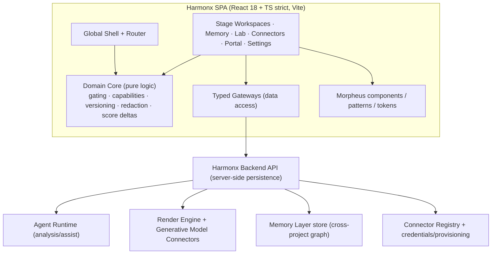
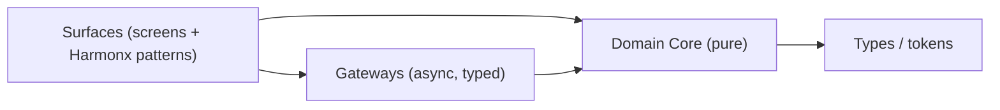
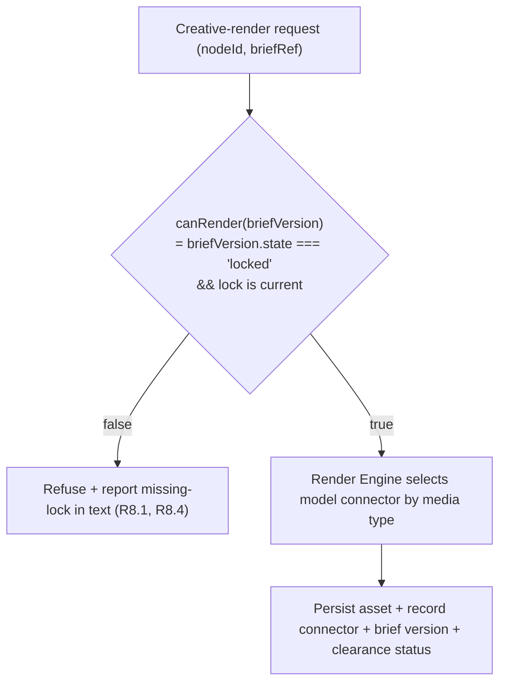
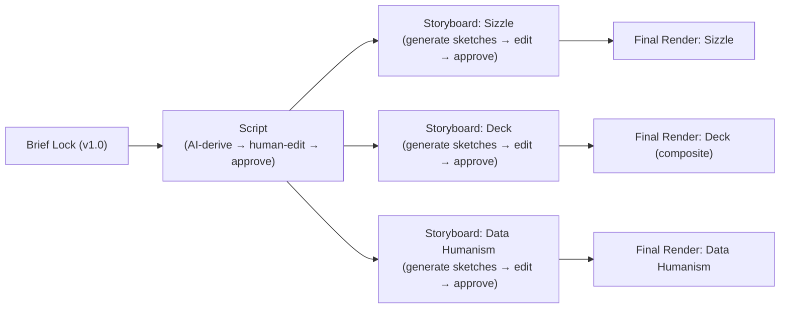

# Design Document — Harmonx — Brand Imprint™ Platform

## Overview

Harmonx is a frontend product: an AI-native brand intelligence workspace built **on top of the Morpheus design system**. It is a React 18 + TypeScript (strict) single-page application bundled with Vite, styled with CSS Modules that reference Morpheus alias tokens only, and assembled from Morpheus components, primitives, and AI patterns (Radix-backed for accessible behavior). It is dark-first (`data-theme`), passes the WCAG 2.2 AA gate as a precondition for ship, and ships reduced-motion / reduced-transparency / forced-colors fallbacks on every surface.

This design covers the whole platform surface area described in the requirements: the global shell and routing, the project/stage data model, the five stage workspaces (Immerse, Uncover, Distill, Direct, Observe), the Brief-Lock gate and the architectural AI-generation gating mechanism, the version/branch model, node detail and the score lifecycle, the Memory Layer graph, Connectors (with the three provisioning modes), the Lab (clones, scenario runner, human testing, crossover), the Render Engine and its pluggable vendor-agnostic generative model connectors, the Narrative Spine, the permissions/capabilities model, the client portal, and the cross-cutting accessibility/AI-a11y approach.

The single governing architectural principle is the **anti-hallucination gate**: pre-lock AI is analysis/assist only; **Creative Render** (generating or persisting a deliverable creative asset) is structurally impossible until a human locks a validated brief (Requirements 7, 8). The design treats this gate as a pure, centrally-owned predicate that every render path must consult, so that it can be unit- and property-tested in isolation rather than re-implemented per surface.

### Design grounding and scope

- **Source of truth.** This design realizes the approved `requirements.md`. Where a requirement maps to a Morpheus component, the component is named; where Harmonx needs something Morpheus does not yet supply, it is flagged as **NEW** and slotted into `/src/patterns` or `/src/components` per `structure.md`.
- **Vendor-agnostic generative models.** No vendor names appear. All generative capability is expressed through a `GenerativeModelConnector` abstraction with a capability descriptor (media type) and a commercial-licensing/clearance attribute.
- **Frontend focus.** Persistence, agent execution, and model inference are server-side concerns reached through typed client gateways. This design specifies the client contracts (interfaces, state, gating predicates, redaction) and the pure domain logic that the UI depends on, not server internals. Per-agent I/O behavior is deferred (OQ-4).

### Morpheus inventory this design builds on

Existing components (composed, not rebuilt): AppBar, Avatar, Badge, Breadcrumb, Button, ButtonGroup, Card, Checkbox, Dialog, Divider, EmptyState, Field, IconButton, InlineMessage, Link, Menu, Popover, Progress, Radio, Select, Sheet, SideNav, Skeleton, Surface, Switch, Tabs, Tag, Textarea, TextInput, Toast, Tooltip; primitive VisuallyHidden.

Existing AI patterns (composed): AgentStatus, CitationCard, ConfidenceIndicator, FeedbackControl, GenerationState, HumanInLoopCard, MessageTurn, PromptInput, ReasoningTrace, StreamingText, SuggestionChips, ToolCallCard.

## Architecture

### System context



The client is layered so that the parts the requirements make verifiable — gating, permissions, versioning, redaction, score-delta retention, credential preference, coverage gating — live in a **Domain Core** of pure, dependency-free TypeScript. Surfaces render Morpheus components and call into the Domain Core and Gateways. This keeps the testable rules out of React and out of the network layer.

### Layered structure



- **Surfaces** (`src/screens/*`, `src/patterns/harmonx/*`): React components. No business rules beyond presentation; they delegate decisions to the Domain Core.
- **Domain Core** (`src/domain/*`): pure functions and reducers. No React, no fetch, no storage. This is where most Correctness Properties are tested.
- **Gateways** (`src/gateways/*`): typed async access to the backend. Mockable; surfaces depend on interfaces.

### Routing and the global shell

Routing is path-based. The shell is one composition of Morpheus `AppBar` (top) + `SideNav` (left primary nav) + a content outlet.

| Route | Surface | Primary Morpheus composition |
|---|---|---|
| `/` | Recent-projects dashboard | AppBar, SideNav, Card (project cards), EmptyState |
| `/companies/:companyId` | Company Overview | CompanyOverview (NEW), GraphCanvas, BrandIntakeFlow, Card (engagement list), TrajectoryChart |
| `/companies/:companyId/engagements/:id` | Engagement Overview (was Project Overview) | StageTimeline (NEW), GraphCanvas (NEW), VersionBranchRail (NEW), Card, Sheet (docked rail) |
| `/companies/:companyId/engagements/:id/:stage` | Stage Workspace | Tabs (Work/History), stage bodies, HistoryTimeline (NEW) |
| `/companies/:companyId/engagements/:id/nodes/:nodeId` | Node Detail | Sheet/Dialog, ScoreLifecycle (NEW), CitationCard, ConfidenceIndicator, GenerationState |
| `/memory` | Memory Layer | GraphCanvas (NEW), Select/Field (filters), Sheet (node panel) |
| `/lab` | Lab | CloneRunner (NEW), MessageTurn, ReasoningTrace, ConfidenceIndicator |
| `/connectors` | Connectors directory | ConnectorGrid (NEW), Tag, Badge, ProvisioningModeBadge (NEW) |
| `/settings/*` | Settings sections | Tabs, Field, Switch, Table-like Card lists |
| `/portal/:token` | Client Portal | PortalShell (NEW), CompanyOverview (read-limited), GraphCanvas (read-limited), CitationCard |

Navigation entries are filtered by the capability resolver before render, so a destination the user cannot access is hidden or disabled rather than rendered inaccessible (R1.6, R12.8).

### The AI-generation gate (architectural mechanism)

The gate is a single pure predicate plus an enforcement choke point:



- `canRender` is defined once in the Domain Core. Every render entry point (Direct stage actions, Node Detail regenerate, export pipelines) calls it; none re-implements it.
- Analysis/assist functions do **not** pass through this choke point — they are classified as non-render and are permitted pre-lock (R8.3, R8.5).
- A render request that references a superseded/removed lock fails `canRender` and is refused with a text explanation (R8.4).

### Theming, motion, material, modality (cross-cutting)

- Dark-first; `data-theme="dark|light"` at the root. Alias tokens only in every Harmonx surface and pattern (no raw hex/px/ms) (R18.1, R18.2).
- Reduced-motion: animated transitions substitute the Morpheus reduced-motion fallback; the "reveal" becomes a plain fade (R18.4).
- Reduced-transparency / forced-colors / low capability: material surfaces drop to Tier 2 solid (R18.5).
- Responsive xs–2xl; reflow to 320px and 200% zoom without loss or horizontal text scroll (R18.3).

## Components and Interfaces

This section maps each surface to its Morpheus composition and names the NEW patterns/components Harmonx must add. NEW items are proposed under `src/patterns/harmonx/` (composed AI/graph surfaces) or `src/components/` (reusable atoms), per `structure.md`.

### New components and patterns (proposed additions)

| Name | Kind | Location | Purpose | Requirements |
|---|---|---|---|---|
| GraphCanvas | pattern | `src/patterns/harmonx/GraphCanvas` | Render Memory Layer / subgraph / portal graph with nodes + backlinks; keyboard-navigable, real semantics | R2.7, R12, R16 |
| StageTimeline | pattern | `src/patterns/harmonx/StageTimeline` | Circular five-stage timeline with substatus + agent-assist badges | R1.3, R2, R5.7 |
| VersionBranchRail | pattern | `src/patterns/harmonx/VersionBranchRail` | Version/branch tree with mainline + branch suffixes | R17 |
| ScoreLifecycle | component | `src/components/ScoreLifecycle` | The 4-step chip strip (Projected→Clone read→Tested→Observed) with deltas + confidence | R11.5, R11.7, R20 |
| ScoreLifecycleChip | component | `src/components/ScoreLifecycle` | Single step chip; text + icon, never color alone | R11.5, R18.7 |
| ConnectorGrid | pattern | `src/patterns/harmonx/ConnectorGrid` | Directory grouped by category/tier; stage tags; counts from registry | R13 |
| ProvisioningModeBadge | component | `src/components/ProvisioningModeBadge` | Shows platform-managed / client-supplied / pass-through | R13.8 |
| ClearanceBadge | component | `src/components/ClearanceBadge` | Surfaces an asset's commercial-licensing/clearance status | R19.9, R25 |
| UpgradeTrigger | component | `src/components/UpgradeTrigger` | Coverage-gap / tier-limit prompt with the specific gap in text | R13.4, R24.3 |
| NarrativeSpineEditor | pattern | `src/patterns/harmonx/NarrativeSpineEditor` | Ordered node-sequence editor with non-drag reorder alternative | R21 |
| BriefLockGate | pattern | `src/patterns/harmonx/BriefLockGate` | Lock modal + pre-lock checklist + capability guard | R7 |
| NodeDetailPanel | pattern | `src/patterns/harmonx/NodeDetailPanel` | Full node detail: evidence, defense copy, score lifecycle, render actions | R11 |
| CloneRunner | pattern | `src/patterns/harmonx/CloneRunner` | Scenario runner: reactions, reasoning, clone-read score, A/B | R14 |
| HistoryTimeline | pattern | `src/patterns/harmonx/HistoryTimeline` | Stage History: inputs, change log, re-enterable diffs | R3 |
| PortalShell | pattern | `src/patterns/harmonx/PortalShell` | Client-facing "Life with [Brand]" shell with redaction + view modes | R16 |
| AssetRenderFrame | component | `src/components/AssetRenderFrame` | Sandboxed render-preview surface; no browser storage | R18.12 |
| OpportunityThesisEditor | pattern | `src/patterns/harmonx/OpportunityThesisEditor` | Author/refine problem, audience+rationale, evidence, sizing, solution rationale; headline sizing + on-demand TAM/SAM/SOM deep dive | R27 |
| DeliverableEditor | pattern | `src/patterns/harmonx/DeliverableEditor` | In-system edit (text, image replace, AI re-render), version history, live-link, external round-trip | R28 |
| UsageCostView | pattern | `src/patterns/harmonx/UsageCostView` | Internal usage + token/cost baseline per model/deliverable/project; billing-gated | R24 |
| BrandIntakeFlow | pattern | `src/patterns/harmonx/BrandIntakeFlow` | URL scrape + document upload + Brand Identity Profile editor; feeds Immerse | R29 |
| ProximitySnapshot | pattern | `src/patterns/harmonx/ProximitySnapshot` | Website lead-gen: conversational intake → micro Data Humanism output → mirage reveal → contact CTA | R29.9 |
| BrandCoherenceBadge | component | `src/components/BrandCoherenceBadge` | Flags deliverables that drift from the ingested brand profile | R29.7 |
| CompanyOverview | pattern | `src/patterns/harmonx/CompanyOverview` | Company-level view: brand profile, all engagements, cross-engagement insights, performance trajectory, shared context | R30 |
| CompanyMemorySubgraph | pattern | `src/patterns/harmonx/CompanyMemorySubgraph` | Company-scoped graph view showing compounding intelligence across engagements | R30.3, R30.4 |
| ScriptEditor | pattern | `src/patterns/harmonx/ScriptEditor` | Inline scene editor for the pre-production Script; per-scene editing of direction/visual/audio/transitions/pacing/tone/copy; lightweight approval action with change-log integration | R32 |
| StoryboardCanvas | pattern | `src/patterns/harmonx/StoryboardCanvas` | Per-deliverable frame sequence showing sketch-level visual pre-viz; references shared Script Scenes; inline-editable frames with layout notes; approval action; overlap-aware (shows format-specific interpretation without re-specifying shared direction) | R33 |

All NEW items follow the Morpheus five-file pattern (`X.tsx`, `X.module.css`, `X.stories.tsx`, `X.test.tsx`, `index.ts`), reference alias tokens only, declare all states, and ship axe + keyboard stories.

### Global shell & dashboard (R1, R26)

- AppBar: workspace switcher (Avatar/Menu), notifications (managed live region via Toast + an in-app inbox), theme/density controls (Switch).
- SideNav: Companies, Memory Layer, Lab, Connectors, Settings — each entry filtered by `resolveCapabilities` (R1.6).
- Dashboard: Card grid of recent companies and engagements (name + stage + substatus, R1.3); EmptyState in Morpheus voice when none (R26.1).

### Project Overview (R2)

StageTimeline + the project memory subgraph (GraphCanvas with the same semantics as Memory Layer, R2.7) + VersionBranchRail + connector summary. A single `Continue` Button whose label is state-derived (`Start → Immerse` | `Continue → {stage}` | `Review`, R2.2). Opening a stage collapses the overview into a docked `Sheet` rail with an expand control (R2.4, R2.5).

### Stage Workspaces (R4–R10)

Every stage is `Tabs` with **Work** and **History** (R3.1). History renders HistoryTimeline (inputs, change log with human/system attribution, re-enterable diffs) (R3.2–R3.5).

- **Immerse (R4, R27):** Field/TextInput/Textarea setup, connector intake, upload (Sheet); the OpportunityThesisEditor authors the durable problem, audience+rationale, evidence, sizing, and solution rationale; submit advances to Uncover; incomplete required fields block submit with text identification (R4.5) via InlineMessage.
- **Uncover (R5):** PromptInput to query connectors + Memory Layer; signal items classified into exactly one Four-Layer Signal Taxonomy layer (Tag); agent-assisted decode with AgentStatus managed live region (R5.6) and a data-driven agent count ("13-agent decode", R5.4); per-stage agent-assist badge (R5.7).
- **Distill (R6, R20, R21):** proposed Core Insight + Emotional-Layer scores (names from config) + proposed taxonomy; accept/edit/add nodes; inline clone cross-reference (lightweight CloneRunner); NarrativeSpineEditor (first-class artifact); ConfidenceIndicator with below-threshold flag (R20.4); terminates in BriefLockGate.
- **Direct (R9, R19, R23, R28, R32, R33):** follows the pre-production sub-pipeline **Lock → Script → Storyboard → Final Render** (R9.8); render actions enabled only while locked; the ScriptEditor presents the AI-derived script for inline editing and lightweight approval; the StoryboardCanvas shows per-deliverable sketch frames for approval before final render; each deliverable is a **projection of the frozen Narrative Spine** (R9.2) that **leads with the Opportunity Thesis** framing before the distilled artifacts (R9.7); the "Life with [Brand]" deck is a **composite deliverable** (applied taxonomy + Data Humanism together, R9.9); the DeliverableEditor supports in-system text/image edits, gated AI re-render, and per-deliverable version history with a canonical live link; internal vs client-facing classification with Resonance-Layer exclusion on client-facing (R9.4); recut via re-lock increments version; export to PDF/deck, Figma, Drive behind Publish-external, with the Harmonx copy remaining canonical (R28.5).
- **Observe (R10):** observed vs projected per node; public-signal vs owned-platform fidelity; writeback admission via the locked-or-ported predicate (R10.5); re-enter Immerse on completion.

### Brief-Lock Gate (R7)

BriefLockGate composes Dialog + Checkbox checklist + HumanInLoopCard rationale. It guards on the `Approve-gate` capability (R7.5), blocks on any unmet checklist item with text (R7.4), and on confirm commits v1.0 recording approver + timestamp (R7.6). It is the only producer of the `locked` brief state the gate predicate reads.

### Node Detail & Score Lifecycle (R11, R20)

NodeDetailPanel (Sheet) shows category, asset type, interpretation, asset render (AssetRenderFrame), Resonance Layer (marked internal-only), served emotional layers, evidence backlinks (CitationCard, discernible names), defense copy, and ScoreLifecycle. Regenerate is disabled without a current lock (R11.4) and routes through `canRender`. Score advancement retains prior step values so deltas are computable (R11.7, R20.3).

### Memory Layer (R12)

GraphCanvas across projects with aggregate stats, search, and filters (project / emotional layer / source / performance delta). Node panel (Sheet) shows appears-in with per-project delta, backlinks, performance writeback. Writeback admitted only from locked-or-ported work (R12.7). Whole surface gated by `Access-memory-layer` (R12.8).

### Connectors & Tiers (R13)

ConnectorGrid groups connectors by category + tier; tags stages each feeds; counts derive from the registry (R13.7); partnership-gated connectors show gated status and block activation (R13.6); read-only without `Manage-connectors` (R13.5). Each connector shows a ProvisioningModeBadge (platform-managed / client-supplied / pass-through, R13.8). Credential preference and redistribution rules are resolved in the Domain Core (R13.10, R13.11).

### Lab (R14)

CloneRunner: clones seeded from decoded profiles; Scenario Runner produces reactions, reasoning, clone-read score, A/B comparison; synthetic resonance summary; Human Testing column (advisory council with veto, recruited segment, live A/B); Tested-score and Crossover-score writeback. Clone output labeled "signal"; text states human testing is confirming ground truth (R14.7).

### Render Engine & Generative Model Connectors (R19)

Vendor-agnostic. The engine selects a `GenerativeModelConnector` by required media type (visual/audio/verbal); Audio modality includes generative **music** conditioned on the decoded persona profile (emotional layers + cultural/structural context + behavioral-KB parameters like tempo/affect) alongside voice/TTS (R19.7). Every connector carries a clearance attribute; rendered assets surface clearance status (ClearanceBadge, R19.8, R19.9) and record producing connector + locked brief version (R19.6).

### Permissions & Capabilities (R15) and Client Portal (R16)

Capabilities are atomic; roles are bundles; resolution is a pure Domain Core function. The Client Portal (PortalShell) leads with the Opportunity Thesis (problem, audience rationale, evidence, and the high-level audience-size + revenue-estimate investment case, with TAM/SAM/SOM available on demand — R16.8, R27.9), then exposes taxonomy + exactly one evidence hop + defense copy, redacts the Resonance Layer and the full graph by default, and gates Login/Share/Download/Live-graph by tier + unlock with the three-mechanism precedence (capability → tier → partnership unlock) (R16.7). View modes: Chronological = frozen Narrative Spine, Linear = report sections, Graph = memory subgraph (R16.1). Settings adds the billing-gated UsageCostView surfacing internal token/cost baselines per model, deliverable, and project (R24.6, R24.7).

### Cross-cutting AI accessibility (R18)

Streaming text announces at sentence/chunk boundaries via `aria-live="polite"` with a "jump to response end" affordance (StreamingText, R18.8); AgentStatus is a debounced managed live region (R5.6, R18); ReasoningTrace is collapsible with `aria-expanded`, not auto-read (R18.9); confidence is text + icon, never color alone (R18.7, R20.2); tool-call/citation cards use real semantics + real links (R18.10).

## Data Models

All models are TypeScript (strict) interfaces living in `src/domain/types`. They are serializable (server-side persistence; no browser storage in render paths, R18.12) and are the input/output shape for the pure Domain Core functions that the Correctness Properties exercise. IDs are opaque branded strings (`ProjectId`, `BriefVersionId`, etc.) to prevent cross-entity mixups.

### Project, Stage, Pipeline

```ts
type StageName = 'immerse' | 'uncover' | 'distill' | 'direct' | 'observe';

interface Project {
  id: ProjectId;
  name: string;
  currentStage: StageName;
  stageSubstatus: string;            // e.g. "brief-lock pending" (R1.3)
  branches: BranchId[];              // project-level sandboxes (R17)
  mainlineBriefVersionId: BriefVersionId | null; // latest locked mainline
  memorySubgraphId: SubgraphId;      // slice of the global Memory Layer (R2.7)
  connectorBindings: ConnectorBinding[];
  shippedDeckVersionId: BriefVersionId | null;   // pinned at ship (R17.5)
}

interface StageEpisode {
  id: StageEpisodeId;
  projectId: ProjectId;
  stage: StageName;
  inputs: StageInputRef[];           // what fed the stage (R3.2)
  changeLog: ChangeLogEntry[];       // ordered, append-only (R3.2, R3.3)
}

interface ChangeLogEntry {
  id: ChangeId;
  at: IsoTimestamp;
  actor: ActorRef;                   // { kind: 'human' | 'system', id }
  summary: string;
  diff: Diff;                        // re-enterable snapshot (R3.4, R3.5)
}
```

The pipeline is circular: `nextStage(observe) === 'immerse'` (R10.6). `StageEpisode` is append-only so any prior episode is re-enterable (R2.6, R3.5).

### Brief and version scheme (R6, R7, R17)

```ts
type BriefState = 'draft' | 'locked' | 'superseded';

interface BriefVersion {
  id: BriefVersionId;
  projectId: ProjectId;
  label: BriefVersionLabel;          // structured, see below
  state: BriefState;
  lock: LockRecord | null;           // present iff state === 'locked'
  opportunityThesis: OpportunityThesis; // FROZEN at lock (R27.5); Core Insight ladders to it
  coreInsight: CoreInsight;
  emotionalScores: EmotionalLayerScore[]; // Belonging/Identity/Trust/Meaning
  taxonomy: NodeId[];                // creative taxonomy node ids
  narrativeSpine: NarrativeSpine;    // FROZEN at lock (R6.6, R21.4)
  parentVersionId: BriefVersionId | null; // lineage for writeback (R10.5)
}

interface LockRecord {
  approver: UserId;                  // held Approve-gate (R7.5, R7.6)
  at: IsoTimestamp;
  checklist: PreLockChecklist;       // all required items met (R7.3, R7.4)
}

// Version scheme (R17.7): mainline v{major}.{minor};
// branch appends a letter suffix; branch re-lock increments branch counter.
interface BriefVersionLabel {
  major: number;                     // 1
  minor: number;                     // 0 -> recut 1
  branchSuffix?: string;             // 'b', 'c' ...
  branchCounter?: number;            // 1, 2 ... (re-lock on branch)
}
// Renders: "v1.0", "v1.1", "v1.0·b", "v1.0·b.1"
```

**Lock currency is per-binding, not global (resolves T-1).** Because branches and recuts mean several versions can be `locked` at once, "current" is defined relative to the *binding* a render targets, never to the latest mainline:

```ts
interface LockScope {
  boundVersionId: BriefVersionId;   // the version this render/deliverable is bound to
}
// A lock is current for a binding iff the bound version is locked and has not been
// explicitly superseded *along its own lineage*. A later mainline recut (v1.1) does NOT
// make a shipped deck's v1.0 binding stale — shipped decks pin to their version (R17.5).
function isLockCurrent(bound: BriefVersion, lineage: BriefVersion[]): boolean;
//  = bound.state === 'locked'
//    && no version in bound's own lineage marks bound as 'superseded'
```

The gate predicate `canRender(scope, lineage)` reads exactly this per-binding currency (R8.1, R8.2, R8.4). This keeps Property 1 (gate) and Property 12 (shipped pin) from contradicting.

### Creative Taxonomy Node and Score lifecycle (R11, R20)

```ts
type EmotionalLayerName = string;    // names from config (R6.2): Belonging/Identity/Trust/Meaning

interface CreativeNode {
  id: NodeId;
  category: string;
  assetType: AssetTypeId;            // maps to required media + model connector class
  interpretation: string;           // "for this brand"
  assetRender: AssetRenderRef | null;
  resonanceLayer: string;            // INTERNAL ONLY (R11.2) — redacted client-side
  servedEmotionalLayers: EmotionalLayerName[];
  evidenceBacklinks: Backlink[];     // to persona/citation/connector (R11.6)
  defenseCopy: string;
  score: ScoreLifecycle;
  originBriefVersionId: BriefVersionId; // back-reference for ports (R17.8)
}

type ScoreStep = 'projected' | 'cloneRead' | 'tested' | 'observed';

interface ScoreLifecycle {
  steps: ScoreStepValue[];           // append-only, in lifecycle order (R11.5, R11.7)
}
interface ScoreStepValue {
  step: ScoreStep;
  value: number;
  confidence: Confidence;            // text-surfaced (R20.1, R20.2)
  at: IsoTimestamp;
}
interface Confidence { value: number; label: string; } // never color-alone (R18.7)
```

Score advancement appends a new `ScoreStepValue` without mutating prior steps, so `delta(stepA, stepB)` is always computable (R11.7, R20.3). **Crossover** is *not* a step here — it is a separate verdict on an insight/node (R14.6, OQ-3).

### Emotional Layers and Core Insight

```ts
interface EmotionalLayerScore { layer: EmotionalLayerName; value: number; confidence: Confidence; }

interface CoreInsight {
  id: InsightId;
  statement: string;
  confidence: Confidence;            // below-threshold flagged in text (R20.4)
  crossoverHypothesis: CrossoverHypothesis | null; // advisory at lock (R21.9)
}

interface CrossoverHypothesis {
  statement: string;
  verdict: CrossoverVerdict | null;  // filled by Lab (R14.6, R21.8)
  crossoverScore: number | null;
}
```

### Opportunity Thesis (R27)

The "why" the whole brief ladders to. Authored in Immerse, refinable through Uncover, frozen at lock; post-lock changes go through a recut (new brief version), never a mutation.

```ts
interface OpportunityThesis {
  problem: string;                   // durable use case / problem (R27.1)
  audience: AudienceRationale;       // who + why them, evidence-backed (R27.3)
  sizing: OpportunitySizing;         // high-level up front, deep-dive on demand (R27.4)
  solutionRationale: string;         // why the full-funnel approach solves it
  confidence: Confidence;
}
interface AudienceRationale {
  description: string;               // e.g. "Black girls, ages 12–16"
  rationale: string;                 // why this audience
  evidence: Backlink[];              // >=1 required; unbacked claims flagged (R27.3)
}
interface OpportunitySizing {
  headline: { audienceSize: number; revenueEstimate: number }; // client-facing (R27.4, R16.8)
  deepDive?: TamSamSom;              // on demand, not immediately exposed
}
interface TamSamSom { tam: number; sam: number; som: number; assumptions: string[]; }
```

`laddersToThesis(insight, thesis)` is a pure check the Distill stage runs (R27.8): a Core Insight that does not resolve the thesis problem is flagged. `redactForClient` keeps the headline sizing but gates the `deepDive` behind an on-demand request (R16.8, R27.9); it never redacts the problem/audience/evidence, which are the client investment case.

### Narrative Spine and beats (R21)

```ts
interface NarrativeSpine {
  beats: NarrativeBeat[];            // ordered; client Chronological view uses this order (R16.1, R21.5)
}

interface NarrativeBeat {
  id: BeatId;
  order: number;
  momentOfDay: string;               // the moment in the persona's day
  nodeIds: NodeId[];                 // node(s) that play in that moment
  emotionalLayers: EmotionalLayerName[];
  evidenceBacklinks: Backlink[];
  defenseCopy: string;
  laddersToInsight: InsightId;       // every beat must ladder to the single Core Insight (R21.3)
}
```

A **Direct deliverable** is a `SpineProjection` — a derived view, not stored narrative:

```ts
type ProjectionFormat = 'report' | 'lifeWithBrand' | 'sizzle' | 'dataHumanism';
interface SpineProjection {
  format: ProjectionFormat;
  sourceSpine: NarrativeSpine;       // the FROZEN spine from the locked brief
  sourceBrief: BriefVersionId;       // dataHumanism charts this brief's scores/deltas
  audience: 'internal' | 'clientFacing';
}
```

`project(spine, format, audience)` is pure: the narrative formats (`report`, `lifeWithBrand`, `sizzle`) re-present frozen beats in order; `dataHumanism` deterministically projects the frozen brief's emotional-layer scores and performance deltas into a **data substrate** (see below). None of them author new beats (R9.2, R21.6). Client-facing projections pass through `redactForClient` (below).

**Post-lock, Final Render is directed by the approved script and storyboard (R32, R33).** The projection model remains — the final render is still a projection of the frozen spine — but its creative direction flows through the pre-production chain: the Script expands each beat into production-ready scene direction, and the per-deliverable Storyboard pre-visualizes the format-specific interpretation. The Final Render then executes against the approved storyboard, not the raw spine alone. This adds creative specificity without changing the structural guarantee (no new beats are authored).

**Data Humanism is a hybrid (reconciles D-5).** The `dataHumanism` projection produces only the **deterministic data substrate** — no generative model touches the quantitative layer (R19.10). A separate **AI styling layer** then renders an aesthetic treatment over that substrate, conditioned on curated Du Bois / Lupi reference assets (R19.13), and passes through the Brief-Lock gate as a Creative Render carrying a clearance status (R19.15). The hard constraint is **data-faithfulness**: the styling layer may change aesthetics but never the plotted values or their encodings (R19.14). So Data Humanism is a projection at the data layer *and* a gated creative render at the styling layer — not either/or.

```ts
// Deterministic quantitative layer — pure projection of the locked brief (R19.10).
interface DataSubstrate {
  sourceBrief: BriefVersionId;
  // Each encoding binds a real brief value to a geometry channel that carries meaning.
  encodings: DataEncoding[];         // stable + reproducible for a given brief
}
interface DataEncoding {
  datumId: string;                   // e.g. "belonging.projected", "node42.delta"
  value: number;                     // the real quantitative value from the brief
  channel: 'height' | 'length' | 'position' | 'angle' | 'area'; // meaning-bearing geometry
  encoded: number;                   // deterministic function of value (bar height, etc.)
}
function projectDataSubstrate(brief: BriefVersion): DataSubstrate; // pure, no model (R19.10)

// AI styling layer: aesthetic treatment conditioned on curated Du Bois / Lupi references (R19.13).
interface StyleConditioning { referenceAssetIds: string[]; }      // vendor-agnostic style inputs
interface DataHumanismRender {
  substrate: DataSubstrate;          // the values/encodings that must be preserved
  styledAssetId: AssetId;            // gated Creative Render output (R19.15)
  clearance: Clearance;              // carried like any render (R19.12, R19.15)
}
// Data-faithfulness check (R19.14): the styled render preserves every substrate value/encoding.
function preservesDataSubstrate(before: DataSubstrate, render: DataHumanismRender): boolean;
//  = every encoding in `render.substrate` matches `before` by datumId, value, channel, and encoded;
//    styling may add aesthetic attributes but may not add, drop, or change a meaning-bearing encoding.
```

### Pre-Production Script and Storyboard (R32, R33)

The Direct stage follows a sub-pipeline post-lock: **Lock → Script → Storyboard → Final Render**. The Script is a shared narrative expansion; Storyboards are per-deliverable visual pre-viz.



**Gating rules:**
- `canRender` (existing) applies to Storyboard generation (sketch-level Creative Render) and Final Render.
- Script generation is **analysis/assist** — it does NOT pass through `canRender` since it is text expansion of locked brief content, not a generative creative asset (R32.9).
- `canGenerateStoryboard(script)` = `script.state === 'approved'` — storyboards are blocked until the script is approved.
- `canFinalRender(storyboard)` = `storyboard.state === 'approved'` — final render for a deliverable is blocked until that deliverable's storyboard is approved.

**Overlap handling:** `ScriptScene` is shared (one per beat, the common creative direction). `StoryboardFrame` is per-deliverable-per-scene (format-specific interpretation referencing the shared scene). This avoids redundant re-specification of scene direction while maintaining per-deliverable specificity.

**Final Render is now directed** by the approved script and the approved storyboard (not just the raw spine). The projection model remains — final render is still a projection of the frozen spine — but its creative direction flows through the approved script/storyboard chain.

```ts
type ScriptApprovalState = 'draft' | 'approved';
type StoryboardApprovalState = 'draft' | 'approved';

interface Script {
  id: ScriptId;
  sourceBrief: BriefVersionId;       // derived from the locked brief
  scenes: ScriptScene[];             // one per spine beat, expanded
  state: ScriptApprovalState;
  approval: ApprovalRecord | null;   // lightweight: who + when
}

interface ScriptScene {
  id: ScriptSceneId;
  beatId: BeatId;                    // references the spine beat it expands
  direction: string;                 // scene direction / narrative
  visualNotes: string;
  audioNotes: string;
  transitions: string;
  pacing: string;
  tone: string;
  copyDirection: string;
}

interface ApprovalRecord {
  approver: UserId;
  at: IsoTimestamp;
}

interface Storyboard {
  id: StoryboardId;
  scriptId: ScriptId;                // derives from approved script
  deliverableFormat: ProjectionFormat; // which deliverable this storyboard is for
  frames: StoryboardFrame[];
  state: StoryboardApprovalState;
  approval: ApprovalRecord | null;
}

interface StoryboardFrame {
  id: FrameId;
  sceneId: ScriptSceneId;           // references the script scene
  sketchAssetId: AssetId | null;    // sketch-level render
  layoutNotes: string;              // format-specific interpretation
  order: number;
}

// Domain predicates (src/domain/gate):
function canGenerateStoryboard(script: Script): boolean;
//  = script.state === 'approved'

function canFinalRender(storyboard: Storyboard): boolean;
//  = storyboard.state === 'approved'
//  NOTE: this is in ADDITION to canRender(scope, lineage) — both must pass for final render.

// Approval recording (R32.7, R33.7): lightweight, appended to the stage change log.
function approveScript(script: Script, approver: UserId, at: IsoTimestamp): Script;
//  = { ...script, state: 'approved', approval: { approver, at } }

function approveStoryboard(storyboard: Storyboard, approver: UserId, at: IsoTimestamp): Storyboard;
//  = { ...storyboard, state: 'approved', approval: { approver, at } }
```

### Memory Layer graph, nodes, backlinks (R12)

```ts
interface MemoryGraph {
  nodes: MemoryNode[];
  backlinks: Backlink[];             // directed edges between memory nodes
}
interface MemoryNode {
  id: MemoryNodeId;
  sourceNodeId: NodeId;
  appearsIn: ProjectAppearance[];    // per-project, each with its delta (R12.5, R12.6)
  writebacks: PerformanceWriteback[]; // only from locked-or-ported lineage (R12.7)
}
interface ProjectAppearance { projectId: ProjectId; performanceDelta: number; }
interface Backlink { from: BacklinkRef; to: BacklinkRef; relation: string; } // real links, discernible names (R18.10)
```

`stats(graph) = { nodeCount, projectCount, backlinkCount }` derives from the graph (R12.2). `admitWriteback(work)` returns true only when `work.lineage` is locked-or-ported (R10.4, R10.5, R12.7).

**Branch renders are project-local until promoted (resolves T-8).** Render provenance (Property 4) writes to the **project memory subgraph** when `RenderedAsset.origin === 'branch'`; it promotes to the **global Memory Layer** only when the node is ported or its branch re-locks onto the mainline. This keeps Property 4 (render provenance to memory) and Property 14 (global writeback only from locked-or-ported lineage) consistent: a branch-only render never reaches global Memory until it earns locked-or-ported lineage.

```ts
function writeRenderProvenance(asset: RenderedAsset, target: { subgraph: SubgraphId } | { global: true }): void;
//  - asset.origin === 'branch'  -> project subgraph only
//  - on port / mainline re-lock -> promote to global Memory
```

### Connector + provisioning mode (R13)

```ts
type ProvisioningMode = 'platform-managed' | 'client-supplied' | 'pass-through';

interface Connector {
  id: ConnectorId;
  category: string;
  tier: TierName;                    // Bootstrap | Foundation | Professional | Full Stack
  feedsStages: StageName[];          // R13.2
  partnershipGated: boolean;         // R13.6
  redistributionProhibited: boolean; // forces client-supplied|pass-through (R13.11)
}

interface ConnectorBinding {
  connectorId: ConnectorId;
  mode: ProvisioningMode;
  clientCredentialPresent: boolean;
  platformCredentialPresent: boolean;
}

// Pure resolution (R13.10, R13.11):
function selectCredential(b: ConnectorBinding): 'client' | 'platform' | 'none';
//  - prefers 'client' when clientCredentialPresent
//  - else 'platform' when platformCredentialPresent AND not redistributionProhibited
//  - else 'none'
```

Directory counts (connectors/categories/touchpoints/asset-types) are computed from the registry, never literals (R13.7, OQ-1).

### Generative Model Connector + Render Engine (R19)

```ts
// Generative modalities are the diffusion/model-driven media only.
// Data-Humanism's DATA SUBSTRATE is not here — it is a deterministic projection (D-5).
// Its STYLING LAYER, however, is a gated Creative Render (see DataHumanismRender above).
type Modality = 'image' | 'video' | 'audioMusic' | 'audioVoice' | 'copy';
type Clearance = 'cleared-commercial' | 'requires-review' | 'restricted';

interface GenerativeModelConnector {
  id: GenModelId;
  modality: Modality;
  clearance: Clearance;              // commercial-licensing attribute (R19.11)
  // vendor-agnostic: no vendor field in the spec contract
}

interface RenderRequest {
  nodeId: NodeId;
  scope: LockScope;                  // per-binding lock currency (resolves T-1)
}
interface DerivedPrompt {            // derived from locked brief, never free-typed (R19.6)
  interpretation: string;
  resonanceLayer: string;
  emotionalLayers: EmotionalLayerName[];
  defenseCopy: string;
  music?: MusicConditioning;         // present only for audioMusic (resolves T-4)
}
// Typed conditioning for generative music (R19.7). Detail of how the behavioral KB
// supplies these is deferred with the per-agent I/O spec (OQ-4), but the shape is fixed
// so music renders are provenance-complete and partly testable today.
interface MusicConditioning {
  emotionalLayers: EmotionalLayerName[];
  culturalContext: string;
  tempoBpm: number;
  affect: string;
}
interface RenderedAsset {
  id: AssetId;
  modality: Modality;
  producedByModelId: GenModelId;     // provenance (R19.7)
  briefVersionId: BriefVersionId;    // provenance (R19.7)
  derivedPrompt: DerivedPrompt;      // provenance (R19.7)
  clearance: Clearance;             // surfaced via ClearanceBadge (R19.12, R25)
  priorVersionId: AssetId | null;    // regenerate retains prior (R19.4)
  origin: 'mainline' | 'branch';     // branch renders stay in project subgraph (resolves T-8)
}
```

`render(req, registry)` = guard with `canRender(req.scope, lineage)` → `selectModel(modality, tier)` → derive prompt from the locked brief → produce asset → stamp provenance (R19.6–R19.7). **Data-Humanism is a hybrid** (reconciles D-5): its **data substrate** is produced by the projection pipeline (`projectDataSubstrate(brief)` via `project(spine, 'dataHumanism')`), deterministic charting over locked-brief data — never diffusion (R19.10); its **styling layer** is then an AI-gated Creative Render conditioned on curated Du Bois / Lupi reference assets (R19.13) that passes through `canRender` and carries a clearance status (R19.15). The styling render is constrained by `preservesDataSubstrate` (R19.14): it may change aesthetics but never a plotted value or meaning-bearing encoding. Because the substrate charts the client's own locked data, the render is inherently `cleared-commercial`; the additional **data-faithfulness guarantee** is what distinguishes it from purely-generative outputs. The Render Engine UI surfaces Data-Humanism under "render", delegating the quantitative layer to the projection pipeline and the aesthetic layer to the gated styling render.

### Deliverable, editing, versioning & live link (R28)

A deliverable is a rendered Direct output with its own edit history. Every edit — human text change, image replace, or AI re-render — appends a `DeliverableVersion`; the Harmonx copy is always the canonical `liveLink`.

```ts
type DeliverableKind = 'brandImprintReport' | 'lifeWithBrand' | 'sizzle' | 'dataHumanism';

interface Deliverable {
  id: DeliverableId;
  kind: DeliverableKind;
  audience: 'internal' | 'clientFacing';
  briefVersionId: BriefVersionId;    // the locked brief it projects (R28.8)
  liveLink: string;                  // canonical, view-only (R28.4)
  versions: DeliverableVersion[];    // append-only edit history (R28.3)
}
type EditKind = 'text' | 'image-replace' | 'ai-rerender';
interface DeliverableVersion {
  id: DeliverableVersionId;
  editKind: EditKind;
  editor: ActorRef;                  // human | system (R28.8)
  at: IsoTimestamp;
  assetRefs: AssetId[];              // ai-rerender versions link RenderedAsset provenance
  priorVersionId: DeliverableVersionId | null;
}
```

- **AI re-render** (`editKind: 'ai-rerender'`) routes through `render(...)` so it passes the gate and is provenance-stamped (R28.2); human text/image edits are recorded but do not require the gate.
- **External round-trip:** opening in Word/Figma/Drive exports a copy; the Harmonx `liveLink` remains canonical and is never silently overwritten by the external tool (R28.5). Re-importing an externally edited file creates a new `DeliverableVersion` explicitly.
- Client-facing deliverables compose `redactForClient` on every version and export (R28.6); editing/exporting client-facing deliverables requires `publish-external` (R28.7).

### Usage & internal cost metering (R24)

```ts
type UsageKind = 'connector-query' | 'clone-run' | 'human-test' | 'asset-render';

interface UsageEvent {
  kind: UsageKind;
  projectId: ProjectId;
  at: IsoTimestamp;
  // token/unit-level detail present for generative renders (R24.6)
  generative?: { modelId: GenModelId; inputUnits: number; outputUnits: number };
}

// Pure aggregation (R24.2): summarize by category and project.
function summarizeUsage(events: UsageEvent[]): UsageSummary;
// Pure baseline (R24.7): total generative consumption for a project across initial
// renders + all edits/re-renders; billing-visible only.
function projectCostBaseline(events: UsageEvent[], rates: RateCard): CostBaseline;
```

`projectCostBaseline` sums every generative `UsageEvent` for a project — including deliverable-edit re-renders — so the internal "what does it cost to create and iterate a project" figure is derivable and attributable per model and per deliverable. Cost figures are gated by `billing-visible` (R24.4); non-cost counts remain visible under `view`.

**Token-cost posture (design note).** AI token consumption is a small fraction of engagement value (<3% of revenue at typical volumes; the expensive component is generative video, not text analysis). Tokens are treated as COGS bundled into tier pricing — clients are billed for intelligence/outcomes, not metered tokens. Each tier carries a render allowance; generative work exceeding it meters as passthrough-plus-markup. Cost-control levers built into the gateways: (1) prompt caching over the reused Memory Layer + Brand Identity Profile context; (2) model tiering — cheap models for classification/routing, reasoning models only for Distill synthesis; (3) batch processing for non-urgent renders; (4) Memory-Layer reuse (decoded knowledge is not re-decoded); (5) optional self-hosted open models for high-volume routine tasks. The `RateCard` used by `projectCostBaseline` carries per-model, per-modality unit rates so these levers are reflected in the internal baseline.

**Agent roster as teammates (design note).** The 13-agent roster is organized by domain (cultural research, humanities/behavioral science, market research, data analysis, data visualization, creative taxonomy, media/channel, design, validation, report compilation). A Super-Agent orchestrator routes tasks, runs the roster in parallel, cross-references outputs, and synthesizes toward the single Core Insight. Per-agent I/O behavior remains deferred (OQ-4); the orchestration contract is captured here only as the collective-run shape the AgentStatus live region reports.

### Brand Identity Profile & Ingestion (R29)

The client's existing brand is ingested at the start of an engagement so all outputs are rendered in-brand. Two paths feed the profile: automated web scrape and manual upload.

```ts
interface BrandIdentityProfile {
  id: BrandProfileId;
  companyId: CompanyId;              // lives at Company level, versioned per engagement
  version: number;                   // versioned alongside the brief (R29.6)
  frozenAtBriefVersion: BriefVersionId | null; // set at lock

  // Extracted / authored brand attributes
  colorSystem: BrandColorSystem;
  typographySystem: BrandTypography;
  voiceAttributes: BrandVoice;
  visualLanguage: BrandVisualLanguage;
  positioningSnapshot: BrandPositioning;
  channelPresenceMap: ChannelPresence[];

  // Ingestion provenance
  sources: BrandIngestionSource[];   // URL scrape results + uploaded docs
}

interface BrandColorSystem {
  primary: string[];                 // hex values
  secondary: string[];
  accent: string[];
  usageRules: string;                // extracted or authored
}
interface BrandTypography { faces: string[]; scale: string; pairingRules: string; }
interface BrandVoice {
  tone: string;                      // formal↔casual, warm↔authoritative
  vocabulary: string[];              // preferred terms
  cadence: string;                   // short/punchy vs long-form
}
interface BrandVisualLanguage {
  photographyStyle: string;
  illustrationApproach: string;
  iconography: string;
  motionPreferences: string;
}
interface BrandPositioning {
  currentPosition: string;
  statedAudience: string;
  keyMessages: string[];
}
interface ChannelPresence { channel: string; tone: string; contentThemes: string[]; }

type IngestionMethod = 'url-scrape' | 'document-upload';
interface BrandIngestionSource {
  method: IngestionMethod;
  url?: string;                      // for scrape
  documentRef?: string;              // for upload
  extractedAt: IsoTimestamp;
}

// Brand coherence check (R29.7): flags deliverables that drift from the ingested profile
function checkBrandCoherence(deliverable: Deliverable, profile: BrandIdentityProfile): CoherenceResult;
type CoherenceResult = { coherent: true } | { coherent: false; drifts: string[] };
```

The **BrandIntakeFlow** pattern (`src/patterns/harmonx/BrandIntakeFlow`) composes: a URL field + scrape trigger, a document upload zone, and the Brand Identity Profile editor (editable cards for each attribute group). It lives in the Immerse stage workspace.

The **ProximitySnapshot** (website lead-gen) uses a lightweight version: URL scrape only → four conversational questions → micro Data Humanism output → mirage-reveal dissolution → contact CTA.

### Company → Engagement hierarchy (R30)

The top-level entity is the **Company** (the client relationship). Engagements (formerly Projects) are nested within.

```ts
interface Company {
  id: CompanyId;
  name: string;
  brandProfile: BrandIdentityProfile;        // lives at Company level
  engagements: EngagementId[];               // ordered by creation
  companyMemorySubgraphId: SubgraphId;       // cross-engagement decoded knowledge
  sharedContextLibrary: SharedContextItem[]; // docs, research, org knowledge
  performanceTrajectory: TrajectoryPoint[];  // compounding value over time
  crossEngagementInsights: InsightId[];      // patterns across audiences/campaigns
}

interface SharedContextItem {
  id: ContextItemId;
  title: string;
  kind: 'document' | 'research' | 'internal-material' | 'org-knowledge';
  uploadedAt: IsoTimestamp;
  uploadedBy: UserId;
  contentRef: string;                // reference to stored content
}

interface TrajectoryPoint {
  at: IsoTimestamp;
  engagementId: EngagementId;
  metricSnapshot: { [key: string]: number }; // flexible KPIs
}

// The existing Project interface is renamed Engagement and gains a companyId:
interface Engagement {
  id: EngagementId;                  // was ProjectId
  companyId: CompanyId;              // parent Company
  name: string;
  currentStage: StageName;
  stageSubstatus: string;
  branches: BranchId[];
  mainlineBriefVersionId: BriefVersionId | null;
  memorySubgraphId: SubgraphId;      // engagement-level subgraph
  connectorBindings: ConnectorBinding[];
  shippedDeckVersionId: BriefVersionId | null;
}
```

**Memory writeback is two-tiered:**
1. `writeToCompanySubgraph(work, companyId)` — on engagement lock/port, always
2. `writeToGlobalMemory(insight, companyId)` — only for cross-client generalizable patterns; client-confidential intelligence stays at Company level

```ts
function writebackTarget(work: LockedWork, company: Company): WritebackTarget[];
// Returns [{company subgraph}] always;
// Returns [{company subgraph}, {global memory}] only when work.isGeneralizable === true
```

### Behavioral & Ethnographic connectors (R31)

A new connector category for ethnographic/field/behavioral data:

```ts
type EthnographicSourceKind =
  | 'field-notes' | 'video-diary' | 'observational-study' | 'ride-along'
  | 'cultural-model' | 'ritual-mapping' | 'identity-narrative'
  | 'environmental-photo' | 'environmental-video'
  | 'academic-paper' | 'behavioral-pattern-library' | 'decision-framework'
  | 'community-forum' | 'oral-history' | 'day-in-the-life' | 'vernacular-corpus';

interface EthnographicConnector extends Connector {
  category: 'behavioral-ethnographic';
  sourceKind: EthnographicSourceKind;
  // Most are upload-based or pass-through commissioned research
}
```

These feed Immerse and Uncover. The platform accepts raw uploads (video, transcripts, notes, photos) and makes them queryable by the agent-assisted decode in Uncover.

### Grounding provenance, Knowledge Base & Admin (R32, R33, R34)

Grounding is a first-class record attached to every agent output, so "grounded, not guessing" is enforced and testable rather than asserted.

```ts
type GroundingKind = 'curated-kb' | 'connector' | 'memory-layer' | 'client-context';

interface GroundingRecord {
  sources: GroundingSource[];        // >=1 required or the output is flagged ungrounded (R32.2)
}
interface GroundingSource {
  kind: GroundingKind;
  ref: BacklinkRef;                  // discernible link to the backing source (R32.3)
}

// Pure: an output is grounded iff it carries >=1 grounding source.
function isGrounded(g: GroundingRecord | null): boolean;      // (R32.1, R32.2)
// Pure: grounding coverage for a brief = fraction of core claims that are grounded.
function groundingCoverage(brief: BriefVersion): number;      // feeds pre-lock checklist (R32.4)
```

The curated behavioral knowledge base has two scopes: an internal cross-client base and a per-Company base. Client-contributed context lands in the Company base; an admin promotes vetted, generalizable, non-confidential entries to the internal base.

```ts
type KbScope = 'internal' | 'company';
type VetStatus = 'unvetted' | 'vetted' | 'deprecated';

interface KbEntry {
  id: KbEntryId;
  scope: KbScope;
  companyId: CompanyId | null;       // set iff scope === 'company'
  statement: string;                 // the framework / mechanism / finding
  citation: Citation | null;         // required to be vetted (R33.5)
  vetStatus: VetStatus;
  contributedBy: ActorRef;           // who supplied it (R33.3)
  at: IsoTimestamp;
  confidential: boolean;             // blocks promotion without admin + consent (R33.6)
}

// Pure guards:
function canGroundClientFacing(e: KbEntry): boolean;          // = e.vetStatus === 'vetted' (R33.5)
function canPromoteToInternal(e: KbEntry, byAdmin: boolean, hasConsent: boolean): boolean;
//  = e.scope === 'company' && e.vetStatus === 'vetted'
//    && (!e.confidential || (byAdmin && hasConsent))          // (R33.4, R33.6)
```

When an agent lacks grounding, the surface prompts the user to contribute context (lived experience, prior findings, uploaded studies), which is recorded to the Company KB (R33.3). The **KnowledgeBasePrompt** pattern handles this inline.

The **Admin Console** is a capability-gated internal surface (`internal-admin`), separate from client surfaces, for managing the KB, agent roster, connectors, companies, and usage/cost.

```ts
type AdminCapability = 'internal-admin';
// Routes under /admin/* are resolved by the capability resolver; client roles never see them (R34.1, R34.6).
```

| Route | Surface | Purpose |
|---|---|---|
| `/admin` | Admin home | Cross-company ops overview (usage, cost, KB coverage, connector health) — R34.4 |
| `/admin/kb` | Knowledge Base manager | Create/edit/vet/deprecate/promote entries — R34.2 |
| `/admin/agents` | Agent roster manager | Manage the data-driven roster that drives the agent count — R34.3 |
| `/admin/companies` | Company operations | Per-company cost-to-create baseline, engagements — R34.5 |

New patterns/components: **AdminConsole** (pattern), **KnowledgeBaseManager** (pattern), **KnowledgeBasePrompt** (pattern, inline context-contribution), **GroundingBadge** (component, shows grounding kind + link).


### Clone (R14)

```ts
interface Clone { id: CloneId; seededFrom: MemoryNodeId[]; profile: DecodedProfile; }
interface ScenarioRun {
  cloneIds: CloneId[];
  stimulus: Stimulus;
  reactions: CloneReaction[];
  reasoning: string;
  cloneReadScore: number;            // labeled "signal" (R14.7)
  abComparison: AbResult;
}
```

### Capability / Role / Audit (R15, R25)

```ts
type Capability =
  | 'edit-project' | 'approve-gate' | 'branch-port' | 'publish-external'
  | 'manage-connectors' | 'access-memory-layer' | 'view' | 'billing-visible'
  | 'ethics-review' | 'conflict-resolver' | 'internal-admin';

// Capabilities are granted within a scope (resolves T-6): a user may be a Strategist on
// project A and only a Viewer on project B; a Client is scoped to their portal only.
type Scope =
  | { kind: 'workspace' }
  | { kind: 'project'; projectId: ProjectId }
  | { kind: 'portal'; portalToken: string };

interface Role { name: RoleName; capabilities: Capability[]; } // Admin/Strategist/Analyst/Producer/Client
interface RoleGrant { roleName: RoleName; scope: Scope; }
interface UserAssignment { userId: UserId; grants: RoleGrant[]; }

// Pure: capabilities the user holds *for a given scope* — workspace grants apply everywhere,
// project/portal grants apply only to that resource (R15.5).
function resolveCapabilities(a: UserAssignment, roles: Role[], at: Scope): Set<Capability>;
function can(caps: Set<Capability>, required: Capability): boolean;

interface AuditEntry {               // append-only (R25.3)
  id: AuditId;
  action: 'lock' | 'port' | 'publish' | 'export' | 'connector-activation' | 'permission-change' | 'render';
  actor: UserId;
  at: IsoTimestamp;
  scope: AuditScope;
}
```

### Client redaction model (R9.4, R11.2, R16.3)

```ts
// Pure: strips Resonance Layer and clamps evidence for client audiences.
// Two distinct clamps (resolves T-2):
//  - node-panel clamp: a single node exposes at most one direct evidence hop
//  - projection/graph clamp: graph traversal depth for the client Graph view is bounded,
//    so an adjacent node's backlink cannot leak a second hop
function redactForClient<T>(value: T): T;          // node/report/deliverable redaction
function redactGraphForClient(g: MemoryGraph, opts: { maxDepth: 1 }): MemoryGraph;
//  - removes resonanceLayer from every CreativeNode/beat projection
//  - node-panel evidence limited to exactly one hop
//  - graph view limited to maxDepth=1 from each surfaced node
//  - removes full-graph access unless partnership-unlocked
```

`redactForClient` and `redactGraphForClient` are the single client-facing boundary; every client projection, graph view, and export composes the appropriate one so redaction cannot be forgotten per-surface, and the node-panel one-hop rule and the graph-traversal-depth rule are tested as separate properties.

### Notifications, live regions & agent-status classification (R5, R22)

```ts
// A single platform event can fan out to both a notification (per affected user) and a
// managed live-region announcement. A shared dedupe key prevents a user who is both an
// approver and a mentioned party from hearing the same event twice (resolves T-7).
interface PlatformEvent {
  id: EventId;
  kind: 'agent-run-complete' | 'brief-lock' | 'observed-data' | 'assignment' | 'mention';
  dedupeKey: string;                 // spans notification + live-region channels
  affectedUserIds: UserId[];
}
function announceOnce(prev: AnnouncedKeys, e: PlatformEvent): { next: AnnouncedKeys; emit: boolean };
//  - emit === true at most once per dedupeKey across both channels

// Agent-status "meaningful change" classifier (resolves T-9). The per-agent I/O is deferred
// (OQ-4), so the predicate is an injected, typed strategy with a documented default; the
// live-region reducer is tested against a stub classifier today and the real one later.
interface AgentStatusChange { agentId: string; phase: string; }
type MeaningfulChangePredicate = (prev: AgentStatusChange | null, next: AgentStatusChange) => boolean;
```

The live-region reducer (Property 36) consumes `MeaningfulChangePredicate` and `dedupeKey`, so debounce behavior is deterministic and unit/property testable without depending on real agent output.

## Correctness Properties

A property is a characteristic or behavior that should hold true across all valid executions of a system — a formal statement about what the system should do. Properties are the bridge between the human-readable acceptance criteria and machine-verifiable guarantees: each is universally quantified ("for all / for any") and is implementable as a single property-based test.

The acceptance-criteria prework identified many criteria that restate the same underlying rule on different surfaces (the gate, capability checks, client redaction, writeback admission). Those were consolidated so each property below validates a distinct rule. Criteria marked example/edge-case/non-testable in the prework are covered by unit tests or manual a11y passes (see Testing Strategy), not by these properties.

### Gate & generation

**Property 1: Render is impossible without a current lock for the bound version**
*For any* render request carrying a `LockScope` (the version the render/deliverable is bound to) and that version's lineage, `canRender(scope, lineage)` returns true if and only if the bound version is `locked` and not superseded along its own lineage; when it returns false the request is refused with a text reason. Lock currency is evaluated per binding, so a later mainline recut never makes an already-bound (e.g. shipped) deck's lock stale. No render entry point (Direct actions, Node Detail regenerate, export) produces or persists an asset when `canRender` is false.
**Validates: Requirements 7.7, 8.1, 8.2, 8.4, 9.6, 11.4, 19.3, 23.6**

**Property 2: Analysis/assist is never gated as a render**
*For any* request, `isCreativeRender(request)` is true exactly when the request generates or persists a deliverable creative asset (image/video/audio/copy for a deliverable or client surface), and false for analysis/assist (connector queries, signal classification, agent decode, proposed taxonomy, clone gut-check, confidence scoring, narrative-spine suggestions); analysis/assist requests succeed without any locked brief.
**Validates: Requirements 8.3, 8.5**

**Property 3: Render prompts are derived from the locked brief, never free-typed**
*For any* render that passes the gate, the derived prompt is a pure function of the locked brief fields (node interpretation, Resonance Layer, served emotional layers, defense copy); a request carrying a free-typed prompt is rejected.
**Validates: Requirements 19.6**

**Property 4: Every rendered asset is fully provenance-stamped, with branch renders project-local**
*For any* rendered asset, it records the producing generative model connector id, the locked brief version, and the derived prompt; this provenance is written to the Audit Log and to memory. A mainline render writes to the global Memory Layer; a branch render (`origin === 'branch'`) writes only to the project memory subgraph and promotes to global Memory only on port or mainline re-lock.
**Validates: Requirements 19.7**

**Property 5: Model selection matches required media; Data-Humanism's data substrate routes to projection; no substitution across a gap**
*For any* node asset type whose media is a purely-generative modality (image/video/audioMusic/audioVoice/copy), the selected generative model connector's modality matches the required media; *for any* Data-Humanism asset, the quantitative data substrate routes to the deterministic projection pipeline rather than a model connector (its styling layer is covered separately by Property 47); if no connector of the required modality is available at the project's tier, the engine surfaces the coverage gap and selects nothing (no unrelated substitution).
**Validates: Requirements 19.2, 19.5, 19.10**

**Property 6: Regenerate retains the prior render as a version**
*For any* regenerate on a node with a current lock, the new asset references the immediately prior asset as its `priorVersionId`, so the render history is preserved.
**Validates: Requirements 19.4**

**Property 7: Surfaced clearance equals the producing connector's clearance**
*For any* rendered asset, the clearance status surfaced on it equals the clearance attribute of the generative model connector that produced it.
**Validates: Requirements 19.12**

### Capability & access

**Property 8: An action is permitted iff the required capability is held for the acting scope**
*For any* user assignment, role set, capability-gated action, and acting scope (workspace / project / portal), the action is permitted if and only if `resolveCapabilities(user, roles, scope)` contains the action's required capability — workspace grants apply everywhere, project/portal grants apply only to that resource. This includes hiding/disabling unpermitted nav (R1.6), Memory-Layer access (R12.8), connector management read-only (R13.5), approve-gate distinct from edit-project (R7.5, R15.3), publish-external for client export (R23.3), comment/assign/notification visibility (R22.1, R22.3, R22.7), and billing/cost visibility (R15.7, R24.4).
**Validates: Requirements 1.6, 7.5, 12.8, 13.5, 15.3, 15.5, 15.7, 22.1, 22.3, 22.7, 23.3, 24.4**

**Property 9: Client redaction removes internal IP, clamps node evidence to one hop, and bounds graph depth**
*For any* value passed through `redactForClient`, the result contains no Resonance Layer and exposes at most one evidence hop per node; *for any* client Graph view passed through `redactGraphForClient` with `maxDepth: 1`, no surfaced node exposes a second hop through an adjacent node's backlink; full-graph access is excluded unless a partnership unlock is set. Every client-facing projection, graph view, and export composes the appropriate redaction function.
**Validates: Requirements 9.4, 11.2, 16.2, 16.3, 23.2, 25.4**

**Property 10: Live-graph access requires all three mechanisms in precedence**
*For any* combination of (capability, tier, partnership-unlock), the Client Portal grants live-graph access if and only if all three pass in order: the acting party holds the required capability, the client's tier makes the portal visible, and an explicit partnership unlock is set; any gated action otherwise renders in a locked state with a text indication.
**Validates: Requirements 16.4, 16.5, 16.6, 16.7**

### Versioning, branching & memory

**Property 11: Brief-version labels round-trip through format/parse**
*For any* valid `BriefVersionLabel` (mainline, recut, branch suffix, branch counter), `parse(format(label))` equals the original label, covering `v1.0`, `v1.1`, `v1.0·b`, and `v1.0·b.1`.
**Validates: Requirements 17.7**

**Property 12: Recut increments version; branch work never mutates the mainline**
*For any* locked mainline `vX.Y`, a recut produces `vX.(Y+1)`; for any branch, cloning creates a sandbox label without altering the Memory graph, and a branch re-lock commits only on that branch, leaving the original mainline version unchanged. A shipped deck stays pinned to its version until a deliberate recut.
**Validates: Requirements 9.5, 17.2, 17.3, 17.5**

**Property 13: Porting moves only the selected node and preserves origin lineage**
*For any* port across branches, exactly the human-selected node is transferred, every other node is unchanged (no automatic merge), and the ported node retains a back-reference to its origin brief version.
**Validates: Requirements 17.4, 17.8**

**Property 14: Global memory writeback is admitted only from locked-or-ported lineage**
*For any* work item, `admitWriteback` returns true if and only if the item descends from a locked-or-ported lineage; branch-only observations and branch-only render provenance that are never re-locked or ported are excluded from the global Memory Layer (they remain in the project subgraph).
**Validates: Requirements 10.3, 10.4, 10.5, 12.7, 17.6**

**Property 15: Locking freezes an immutable brief snapshot**
*For any* draft brief, locking produces a version whose Opportunity Thesis, Core Insight, emotional-layer scores, creative taxonomy, and Narrative Spine equal the draft at lock time; subsequent project edits (including edits to the thesis) do not mutate the frozen version — they require a recut to a new version.
**Validates: Requirements 6.6, 7.6, 21.4, 27.5, 27.7**

**Property 16: Aggregate graph stats equal the true derived counts**
*For any* Memory graph, `stats(graph)` equals the actual node count, project count, and backlink count derived from the graph.
**Validates: Requirements 12.2**

**Property 17: Search and filter results satisfy their predicates**
*For any* query/filter and any Memory graph, every returned node satisfies the query/filter predicate (project, emotional layer, source/connector, performance delta), and a node appearing in K projects yields exactly K cross-project appearances.
**Validates: Requirements 12.3, 12.4, 12.5**

### Score lifecycle & confidence

**Property 18: Score advancement is append-only and order-preserving**
*For any* sequence of score advancements, steps appear in canonical order (Projected → Clone read → Tested → Observed), prior step values and confidences are retained, and the delta between any two steps is computable.
**Validates: Requirements 11.5, 11.7, 20.3**

**Property 19: Confidence is present and conveyed by text + icon, never color alone**
*For any* Core Insight and any node score step, a confidence value is attached; *for any* status or confidence render, the output contains text and an icon and never relies on color alone.
**Validates: Requirements 18.7, 20.1, 20.2**

**Property 20: Low-confidence insights are flagged in text at Distill and pre-lock**
*For any* Core Insight whose confidence is below the configured threshold, it is flagged in text in the Distill stage and as an item in the pre-lock checklist.
**Validates: Requirements 20.4**

### Pipeline, stages & provenance

**Property 21: Stage transitions follow the circular pipeline**
*For any* stage, the submit/advance transition is deterministic and circular: immerse→uncover→distill→direct→observe→immerse.
**Validates: Requirements 4.4, 5.5, 10.6**

**Property 22: Incomplete required input blocks submission and names the gaps**
*For any* stage input set with at least one missing required field, submission is blocked and every missing field is identified in text (Immerse setup; pre-lock checklist unmet items, including an absent, unbacked, or unsized Opportunity Thesis).
**Validates: Requirements 4.5, 7.4, 27.6**

**Property 23: Signal items carry exactly one taxonomy layer**
*For any* surfaced signal set, each item is classified under exactly one of the four signal-taxonomy layers (Stated preference, Revealed behavior, Cultural velocity, Structural context).
**Validates: Requirements 5.3**

**Property 24: Data-driven counts equal registry/roster derivations**
*For any* agent roster the displayed agent count equals the roster length; *for any* connector registry the displayed connector/category/touchpoint/asset-type counts equal the registry derivations; *for any* layer config the scored emotional layers equal the configured names.
**Validates: Requirements 5.4, 6.2, 13.7**

**Property 25: Every change-log entry is attributed and re-enterable**
*For any* change-log entry, it records the actor, timestamp, and whether the change was human or system; *for any* recorded diff (including narrative-spine reorders and beat-binding changes), applying it reconstructs the state it captured.
**Validates: Requirements 3.3, 3.4, 3.5, 21.10**

### Narrative spine & projections

**Property 26: Projections lead with the thesis, preserve spine order, and author no new beats**
*For any* frozen Narrative Spine and any projection format, `project(spine, format)` preserves the beat order and introduces no beats absent from the spine, and every deliverable/portal projection places the Opportunity Thesis framing ahead of the distilled artifacts; the Client Portal Chronological view uses exactly the frozen beat order.
**Validates: Requirements 9.2, 9.7, 16.1, 21.5, 21.6, 27.9**

**Property 27: Every beat is well-formed and ladders to the single Core Insight**
*For any* beat in a spine, it binds a moment-of-day, one or more nodes, one or more emotional layers, and evidence + defense copy, and references the project's single Core Insight; any beat that does not ladder to the Core Insight is flagged.
**Validates: Requirements 21.2, 21.3**

**Property 28: Absent crossover hypothesis is advisory, not blocking**
*For any* Core Insight without a Crossover Hypothesis, the pre-lock checklist surfaces an advisory item and the lock is not blocked on that basis.
**Validates: Requirements 21.9**

### Connectors, lab, metering & governance

**Property 29: Credential resolution prefers client-supplied and never violates redistribution rules**
*For any* connector binding, `selectCredential` returns `client` when a client credential is present; otherwise `platform` only when a platform credential is present and the source is not redistribution-prohibited; otherwise `none`. A redistribution-prohibited source never resolves to `platform` and must be provisioned client-supplied or pass-through.
**Validates: Requirements 13.9, 13.10, 13.11**

**Property 30: Coverage gaps and tier thresholds surface a specific upgrade trigger**
*For any* required-asset/usage set that exceeds the current tier's coverage or limit, an upgrade trigger is surfaced naming the specific gap; partnership-gated connectors cannot activate without an unlock.
**Validates: Requirements 13.4, 13.6, 24.3, 25.6**

**Property 31: Clone results are labeled signal and write the correct verdicts back**
*For any* clone scenario run the result is labeled "signal" (with text stating human testing is the confirming ground truth); *for any* human-test result a Tested score writes back; *for any* community-insight crossover run, a crossover verdict and score are produced and written back and associated with the hypothesis.
**Validates: Requirements 14.5, 14.6, 14.7, 21.8**

**Property 32: Every metered action records exactly one usage event with token detail, and aggregates correctly**
*For any* metered action (connector query, clone run, human-test run, asset render/re-render) exactly one usage event is recorded — generative renders carrying token/unit-level detail — and *for any* set of usage events the usage summary equals the per-category and per-project aggregation of those events.
**Validates: Requirements 19.8, 24.1, 24.2, 24.6**

**Property 33: The Audit Log is append-only and scope/range export is exact**
*For any* sequence of capability-gated actions (lock, port, publish, export, connector activation, permission change, render), the Audit Log only grows and never mutates prior entries; *for any* scope and time range, an audit export returns exactly the entries within that scope and range.
**Validates: Requirements 25.3, 25.5**

**Property 34: Ingested sources record a consent basis or are flagged and client-excluded**
*For any* ingested source, the source and its consent/licensing basis are recorded; if the basis is absent, the source is flagged in text and excluded from client-facing outputs until resolved.
**Validates: Requirements 25.1, 25.2**

### Notifications, material & onboarding

**Property 35: Meaningful events notify affected users exactly once per dedupe key; mentions notify the mentioned user**
*For any* meaningful platform event (agent-run completion, brief lock, observed-data arrival, assignment, mention) a notification is generated for each affected user, and a comment mentioning user U generates a notification for U; a user who is affected through multiple roles in one event (e.g. approver and mentioned party) is notified at most once per event `dedupeKey`.
**Validates: Requirements 22.2, 22.4, 22.6**

**Property 36: Managed live regions announce each meaningful change exactly once across channels**
*For any* sequence of agent-status frames or notification events, the managed live-region reducer emits exactly one announcement per meaningful change — determined by the injected `MeaningfulChangePredicate` and de-duplicated by `dedupeKey` across the notification and live-region channels — and never announces per intermediate frame.
**Validates: Requirements 5.6, 22.5**

**Property 37: Streaming text announces at sentence/chunk boundaries, never per token**
*For any* token stream, the screen-reader announcer batches output to sentence or chunk boundaries (or completion) and never announces per token, and exposes a "jump to response end" affordance.
**Validates: Requirements 18.8**

**Property 38: Material tier and motion resolve to fallbacks under reduced conditions**
*For any* material token under `prefers-reduced-transparency`, forced-colors, or low-capability, the resolved tier is Tier 2 (solid); *for any* animated transition under `prefers-reduced-motion`, the resolver returns the reduced-motion fallback variant.
**Validates: Requirements 18.4, 18.5**

**Property 39: Citations and backlinks render as real links with discernible names**
*For any* citation card or evidence backlink, the source renders as a real anchor element with a non-empty, discernible accessible name resolving to its source (persona, citation, or connector).
**Validates: Requirements 11.6, 18.10**

**Property 40: Destructive actions require confirm/undo before commit**
*For any* action flagged destructive or irreversible, a confirmation or undo step is required before the action commits.
**Validates: Requirements 18.13**

**Property 41: Dismissed onboarding is not re-presented until reset**
*For any* dismissible onboarding guidance, once dismissed it is not re-presented unless the user resets it in Settings (dismissal is idempotent across sessions).
**Validates: Requirements 26.4**

**Property 42: The continue affordance and empty states are state-derived**
*For any* project state, the Project Overview continue label is the correct state mapping (new → "Start → Immerse", mid-flight → "Continue → {stage}", shipped → "Review"); *for any* empty surface, the empty state names the surface and offers its primary next action.
**Validates: Requirements 2.2, 26.1, 26.2**

### Opportunity Thesis, deliverable editing & internal cost

**Property 43: The Opportunity Thesis is well-formed, evidence-backed, and the Core Insight ladders to it**
*For any* Opportunity Thesis, all five parts are present (problem, audience+rationale, evidence, sizing, solution rationale); an audience claim with zero evidence backlinks is flagged and one with at least one backlink is not; and *for any* brief, `laddersToThesis(coreInsight, thesis)` holds or the Core Insight is flagged as not resolving the framed problem.
**Validates: Requirements 27.1, 27.3, 27.8**

**Property 44: Headline sizing is always exposed; the deep-dive is only on demand**
*For any* Opportunity Thesis in any client-facing projection, the headline sizing (audience size + revenue estimate) is present, while the TAM/SAM/SOM deep-dive is absent from the default view and present only when explicitly requested.
**Validates: Requirements 27.4, 16.8**

**Property 45: Deliverable edits are append-only and attributed; external open never overwrites the canonical copy**
*For any* sequence of deliverable edits (text, image-replace, AI re-render), each edit appends a new Deliverable Version recording the source brief version and the human|system editor, prior versions are retained, and opening the deliverable in an external editor leaves the canonical live-link content unchanged unless an explicit re-import creates a new version.
**Validates: Requirements 28.3, 28.5, 28.8**

**Property 46: Project cost baseline equals summed generative consumption including edits, and is billing-gated**
*For any* set of usage events for a project, `projectCostBaseline` equals the sum of generative consumption across initial renders and all edit/re-render events (model-based against a naive sum), and cost figures are exposed only to users holding the billing-visible capability.
**Validates: Requirements 24.7**

**Property 47: Data Humanism styling preserves the deterministic data substrate**
*For any* Data Humanism render — a deterministic data substrate produced by `projectDataSubstrate(brief)` plus an AI styling layer applied on top — `preservesDataSubstrate(substrate, render)` holds: the styled output preserves every meaning-bearing encoding of the substrate (each datum's value, geometry channel, and encoded magnitude such as bar height, proportion, or position), and adds, drops, or changes none of them. A styling change never changes a plotted value; the render remains a truthful representation of the substrate, and re-styling the same substrate yields the same underlying encodings.
**Validates: Requirements 19.10, 19.13, 19.14, 19.15**

**Property 48: Brand Identity Profile is versioned with the brief, editable, and drives coherence checks**
*For any* Brand Identity Profile, it is editable by a user with edit capability; when a brief is locked the active profile version is frozen with the brief version; *for any* deliverable checked against a profile, `checkBrandCoherence` returns coherent when no drift is detected and returns the specific drifts when the output diverges from the ingested brand attributes. The profile frozen at lock cannot be mutated — changes require a recut.
**Validates: Requirements 29.5, 29.6, 29.7**

**Property 49: Every agent output is grounded or flagged, and grounding is source-linked**
*For any* agent analysis output, `isGrounded` is true if and only if it carries at least one grounding source (curated-KB, connector, memory-layer, or client-context); an output with no grounding source is flagged ungrounded in text and excluded from satisfied pre-lock checklist items; every grounding source resolves to a discernible backing link. `groundingCoverage` equals the fraction of core claims that are grounded.
**Validates: Requirements 32.1, 32.2, 32.3, 32.4, 32.5**

**Property 50: Knowledge-base vetting and promotion rules hold**
*For any* KB entry, it can ground a client-facing output only when vetted; a Company-scoped entry can be promoted to the internal cross-client base only when it is vetted and either non-confidential or promoted by an admin with a recorded consent basis; an entry lacking a citation or vetting status is unvetted and excluded from client-facing grounding.
**Validates: Requirements 33.4, 33.5, 33.6**

**Property 51: Regulated categories and protected audiences force ethics review before lock**
*For any* engagement flagged with a regulated category or protected audience, the Brief-Lock Gate blocks the lock until an ethics-review checklist item is completed by a user holding the ethics-review capability; a creative render that violates a configured bright-line prohibition is refused with a text reason; ethics-review actions are recorded in the Audit Log.
**Validates: Requirements 35.2, 35.3, 35.4, 35.5**

**Property 52: Impact is only attributed under a controlled design; otherwise reported as correlation or unverified**
*For any* Observe result, causation is presented only when a controlled comparison design (holdout or matched-market) is recorded; without it the result is presented as correlation, and without a data-access arrangement it is marked unverified. Reported confidence is always text-surfaced.
**Validates: Requirements 36.2, 36.3, 36.5, 36.6**

**Property 53: Agent conflicts are surfaced and human-resolved, never silently chosen**
*For any* set of conflicting agent outputs on the same signal/node/score, the platform surfaces the conflict with each output's grounding, requires a human with edit capability to select a resolution type (accept one / accept both as coexisting / merge / reject both), escalates to a conflict-resolver capability when resolvers disagree, records the resolution type with actor and rationale, and flags an unresolved core-claim conflict in the pre-lock checklist.
**Validates: Requirements 37.1, 37.2, 37.3, 37.4, 37.5, 37.6**

**Property 54: Company data is isolated across tenants**
*For any* two Companies, one Company's confidential data (brand profile, company KB, memory subgraph, uploads) is never readable in the other's scope; access to sensitive data is capability-scoped and recorded.
**Validates: Requirements 38.1, 38.2**

### Pre-production pipeline

**Property 49: Final render is blocked until the relevant storyboard is approved**
*For any* deliverable and its associated storyboard, `canFinalRender(storyboard)` returns true if and only if `storyboard.state === 'approved'`; when it returns false, the final render request for that deliverable is refused with a text reason stating that an approved storyboard is required. A deliverable whose storyboard is in `draft` state never produces a final render asset.
**Validates: Requirements 33.8, 9.8**

**Property 50: Storyboard generation is blocked until the script is approved**
*For any* script, `canGenerateStoryboard(script)` returns true if and only if `script.state === 'approved'`; when it returns false, all storyboard generation requests are refused with a text reason stating that an approved script is required. No storyboard frame is generated or persisted while the script remains in `draft` state.
**Validates: Requirements 32.10, 33.9**

**Property 51: Script and storyboard approvals are recorded with actor + timestamp in the change log**
*For any* script approval or storyboard approval, the resulting `ApprovalRecord` contains a non-null `approver` (UserId) and a non-null `at` (IsoTimestamp); *for any* such approval event, a corresponding `ChangeLogEntry` is appended to the stage's change log with the actor, timestamp, and a re-enterable diff capturing the state transition from `draft` to `approved`.
**Validates: Requirements 32.7, 33.7, 3.3**

## Error Handling

Errors are handled in three bands, matching the layered architecture, and always honor the Morpheus voice (plain, precise in error states) and AA (text + icon, never color alone).

### Domain Core (pure) — typed results, no exceptions for expected failures

- Gating, capability, credential resolution, writeback admission, and version operations return **discriminated result types** (`Ok | Refused{reason}`) rather than throwing. The gate's refusal carries a human-readable, screen-reader-available reason (R8.1, R8.4). This makes refusal paths directly property-testable.
- Invariant violations that indicate a programming error (e.g., a `ScoreLifecycle` with steps out of canonical order) throw a tagged `InvariantError`; these are never expected at runtime and are surfaced in development and tests, not to end users.

### Gateways (async) — fault classification + retry policy

- Network/server faults are classified as `transient` (retryable with backoff) vs `permanent` (surface immediately). Connector-query and render gateways debounce and de-duplicate in-flight requests.
- A render request that the server rejects for a missing/stale lock is normalized to the same `Refused{missing-lock}` shape the Domain Core uses, so the UI has one refusal path (R8.4).
- Connector credential failures map to actionable text ("client-supplied credential expired") and never silently fall back to a platform credential when the source is redistribution-prohibited (R13.11).

### Surfaces (React) — visible, recoverable, accessible

- **InlineMessage** for field-level and blocking-validation errors (incomplete Immerse setup, unmet checklist items), naming each gap in text (R4.5, R7.4).
- **Toast** (managed live region, announced once) for asynchronous outcomes (render complete/failed, export complete, writeback recorded) (R36 area, R22.5).
- **GenerationState** pattern shows render in-progress/failed/empty with a retry affordance; failure preserves the prior asset version (R19.4).
- **Error boundaries** per surface prevent a single failing pattern (e.g., GraphCanvas) from taking down the shell; the boundary renders an EmptyState-style recovery with a reload action.
- **Destructive/irreversible actions** (lock, port, publish/export, connector activation, permission change) require a confirm step with undo where reversible (R18.13); the confirmation text carries the consequence in the accessible name (R-a11y, HumanInLoopCard).
- Streaming failures stop the `aria-live` announcer cleanly and present a "response interrupted" message rather than leaving a partial half-announced sentence (R18.8).

### Governance/consent failures

- A source ingested without a consent/licensing basis is flagged in text and excluded from client-facing outputs until resolved (R25.2); attempts to export such content are refused with the specific reason and recorded in the Audit Log.

## Testing Strategy

The platform uses a **dual approach**: property-based tests for the universal rules above, and unit/interaction/a11y tests for specific examples, edge cases, and rendering. They are complementary — property tests verify general correctness across generated inputs; unit tests pin concrete behavior and integration points.

### Tooling

- **Vitest** as the test runner.
- **fast-check** for property-based testing (the chosen PBT library for TS — not hand-rolled). Each property test runs **≥ 100 iterations** (`{ numRuns: 100 }` or higher) because inputs are randomized.
- **@testing-library/react** for interaction/rendering tests.
- **jest-axe** (axe-core) for automated a11y assertions on every component and pattern (per steering: axe on every component).
- **Playwright** for keyboard-only paths and visual/reflow passes (200% zoom, 320px reflow, forced-colors) — the manual-leaning a11y criteria (R18.3, R18.6) are covered here, not by unit PBT.

### Property-based tests

- Each Correctness Property (1–46) is implemented by a **single** fast-check property test.
- Generators live in `src/domain/__generators__`: arbitraries for `Project`, `BriefVersion` (draft/locked/superseded/branch), `BriefVersionLabel`, `OpportunityThesis` (backed/unbacked, sized/unsized), `CreativeNode` + `ScoreLifecycle`, `NarrativeSpine`/`NarrativeBeat`, `Deliverable` + edit sequences, `MemoryGraph`, `Connector`/`ConnectorBinding`, `UserAssignment`/`RoleGrant`/`Scope`, usage-event streams (with generative token detail), agent-status frame sequences, and token streams. Generators deliberately produce edge cases flagged in prework: empty content, whitespace, non-ASCII, redistribution-prohibited sources, superseded locks, branch-only lineages, and unbacked audience claims.
- Each property test is tagged with a comment in the format:
  `// Feature: harmonx-platform, Property {number}: {property title}`
  and references the requirements it validates.
- Highest-value targets (test these first, nearest the implementation): Property 1 (gate), 8 (capability), 9 (redaction), 14 (writeback), 18 (score append-only), 26 (projection), 29 (credential resolution), 11 (version round-trip).

### Unit & interaction tests (examples, edge cases, integration)

- Example-level criteria from prework (render presence, specific surfaces, structural assertions) are unit/interaction tests: shell destinations (R1.1), Work/History tabs (R3.1), deliverable availability while locked (R9.1), settings sections (R15.6), provisioning-mode display (R13.8), audio-music modality presence (R19.9), data-humanism data-substrate routing and styling-layer gate (R19.10, R19.15).
- Edge cases relying on generators (empty/whitespace/non-ASCII inputs, zero-node graphs, single-beat spines) are asserted both as concrete unit tests and exercised by the property generators.
- Keep unit tests focused — do not duplicate what a property already covers across many inputs.

### Accessibility tests (the gate)

- jest-axe on every component/pattern story (rest/hover/focus/active/selected/disabled/loading/error states).
- Playwright keyboard-only traversal of each primary task; focus-not-obscured checks against sticky regions (R18.6); reduced-motion, reduced-transparency, and forced-colors media-emulation passes (R18.4, R18.5); 200%/320px reflow (R18.3).
- Manual VoiceOver + NVDA spot checks for AI surfaces: streaming announcement boundaries (R18.8), agent-status debounce (R5.6), reasoning-trace `aria-expanded` not auto-read (R18.9).

## Resolved Design Decisions (folded-in tension resolutions)

The seams surfaced while modeling have been resolved and folded into the data models and properties above. They are retained here as a decision record.

**D-1 (was T-1) — Lock currency is per-binding, not global.** Render requests carry a `LockScope` naming the version they are bound to; `isLockCurrent` evaluates currency along the bound version's own lineage. A later mainline recut (`v1.1`) does not stale an already-shipped `v1.0` deck. Folded into the Brief data model and Property 1; reconciles with the shipped-deck pin (Property 12).

**D-2 (was T-2) — Redaction is two distinct clamps.** `redactForClient` handles node/report/deliverable redaction (Resonance Layer removed, one direct evidence hop per node); `redactGraphForClient(maxDepth: 1)` bounds client Graph-view traversal so an adjacent node's backlink cannot leak a second hop. Folded into the redaction model and Property 9.

**D-3 (was T-3) — Derived prompts only; art-direction is a recut.** The anti-hallucination guarantee holds the line: render prompts are pure functions of the locked brief and free-typed prompts are rejected (Property 3). A producer who wants a creative change edits the brief and recuts (cheap on a branch, `v1.0·b`), which keeps every render traceable to committed brief content. There is no un-versioned prompt override.

**D-4 (was T-4) — Music conditioning is typed.** `MusicConditioning { emotionalLayers, culturalContext, tempoBpm, affect }` makes audio-music renders provenance-complete. How the behavioral KB supplies those values is deferred with the per-agent I/O spec (OQ-4), so music conditioning correctness is example-tested today; the typed shape lets the property suite assert provenance now.

**D-5 (was T-5) — Data-Humanism is a hybrid: deterministic substrate + gated styling layer.** The **quantitative data substrate** is removed from `Modality` and produced by the projection pipeline (`projectDataSubstrate(brief)` via `project(spine, 'dataHumanism')`) — deterministic charting over the frozen brief's scores and deltas, never diffusion (R19.10). On top of it, an **AI styling layer** renders an aesthetic treatment conditioned on curated Du Bois / Lupi reference assets (R19.13) and passes through the Brief-Lock gate as a Creative Render carrying a clearance status (R19.15). The hard constraint is **data-faithfulness**: `preservesDataSubstrate` guarantees the styling changes aesthetics but never a plotted value or meaning-bearing encoding (R19.14). So it is a projection at the data layer *and* a gated creative render at the styling layer — not either/or (this supersedes the earlier "projection, not a generative modality" framing). Because it charts the client's own locked data it is inherently `cleared-commercial`; the extra data-faithfulness guarantee is what purely-generative outputs lack. Folded into the projection/Data Humanism models and Properties 5, 26, and the new Property 47.

**D-6 (was T-6) — Capabilities are scoped.** Grants carry a `Scope` (workspace / project / portal); `resolveCapabilities(user, roles, at)` resolves per acting scope so a user can be a Strategist on one project and a Viewer on another, and a Client is confined to their portal. Folded into the permissions model and Property 8.

**D-7 (was T-7) — Shared dedupe key across notification and live-region channels.** A `PlatformEvent.dedupeKey` spans both channels so a user who is affected through multiple roles in one event is announced/notified at most once. Folded into the notifications model and Properties 35 and 36.

**D-8 (was T-8) — Branch renders are project-local until promoted.** Branch render provenance writes only to the project memory subgraph and promotes to the global Memory Layer on port or mainline re-lock. This keeps render-provenance writeback (Property 4) consistent with locked-or-ported-only global writeback (Property 14).

**D-9 (was T-9) — Agent-status "meaningful change" is an injected predicate.** The live-region reducer consumes a typed `MeaningfulChangePredicate` with a documented default, so debounce behavior is deterministic and testable against a stub today; the real classifier arrives with the deferred per-agent I/O spec (OQ-4). Folded into the notifications model and Property 36.
